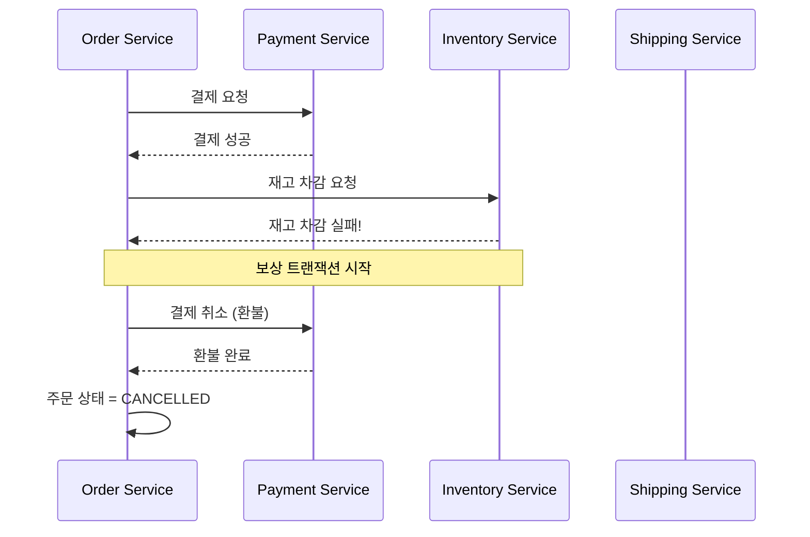
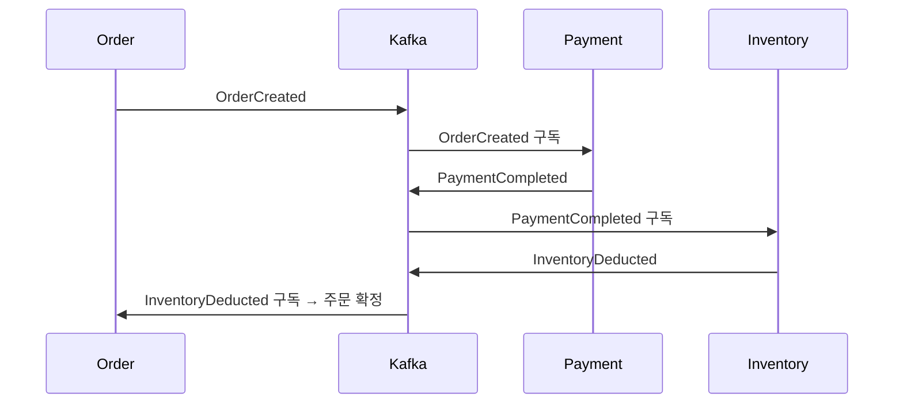
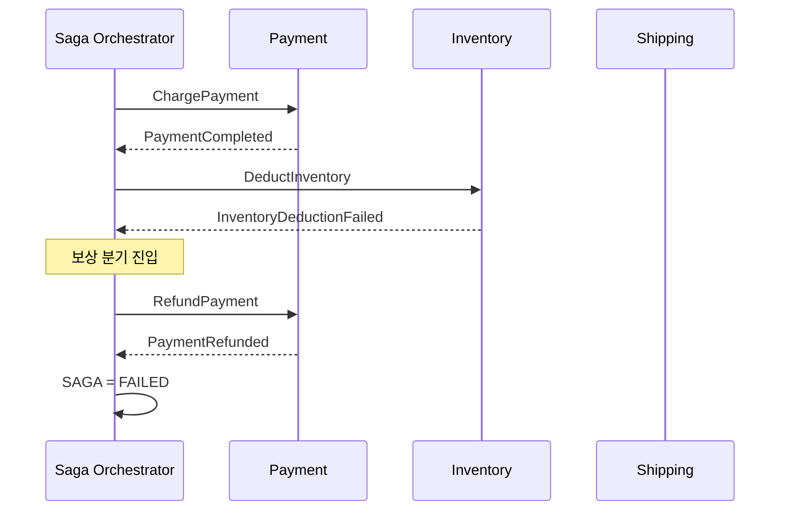
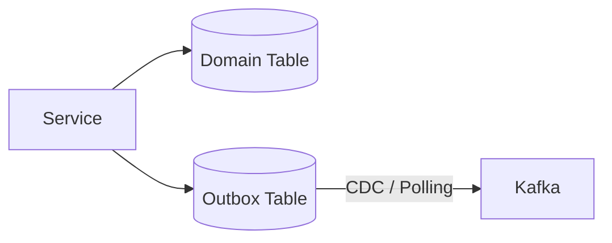

# SAGA 패턴

## 들어가며

전전 직장인 더커머스는 JOB을 매번 DB에 저장하고 폴링(polling) 해서 사용함으로써 DB 부하가 커서 인프라 팀이 불평을 한 기억이 있고, 반대로 바잉 스퀘어에서는 오래 걸리는 재고 처리 부분을 따로 분리한 경험이 있다. 다만 그때는 "재고 이슈가 들어왔을 때 롤백을 어떻게 하느냐"에 대해 고민은 해봤지만, B2B 특성상 오더가 submit → confirm 순서인 TCC형태였기 때문에 롤백은 아예 구현하지 않고 넘어간 경험이 있다.

하지만, 언젠가 다시 이 문제에 대해 고민하게 될 기회가 있다고 생각했고, 나중에 찾게된 이문제의 해결책이 SAGA 패턴이였다.

## 분산 트랜잭션 환경에서 ACID가 안 되는 이유

분산 트랜잭션은 트랜잭션을 분리해서 각자 커밋한다는 특성 때문에 DB의 핵심 특성인 ACID를 그대로 지키기 어렵다.

### ACID란?

- **원자성 (Atomicity)**: 트랜잭션의 작업은 모두 반영되거나(Commit) 모두 취소(Rollback)되어야 한다.
- **일관성 (Consistency)**: 트랜잭션이 완료되면 언제나 일관된 데이터베이스 상태를 유지해야 한다.
- **격리성 (Isolation)**: 둘 이상의 트랜잭션이 동시에 실행될 때 서로 간섭할 수 없어야 한다.
- **영속성 (Durability)**: 성공적으로 완료된 트랜잭션의 결과는 영구적으로 반영되어야 한다.

이 4가지 항목을 준수하기 위해서는 2PC(Two-Phase Commit)를 사용하는 방법이 있는데, 간단하게 요약하자면 여러 개의 트랜잭션을 하나로 묶어 "prepare(준비) → commit(확정)" 두 단계로 처리하는 방식을 말한다.
그런데 여기엔 치명적인 문제가 있다.
1. 모든 DB가 같이 커밋된다는건 모두가 커밋될 때까지 락을 붙잡고 있다는 뜻이라, 락 시간이 길어져서 DB 처리량이 크게 떨어진다.
2. 만약 하나의 DB가 커밋 시도중에 다운이 되는 경우, 그 상황을 알 수 없는 다른 DB들은 락을 건채로 그대로 중지된다.
3. 호환성에 문제, 외부 API에 요청을 한다던가, NoSQL 등의 트랜잭션을 지원하지 않는 시스템이 너무 많다.

그래서 발상의 전환으로 강한 일관성 (Consistency)을 포기하고, 결과적 일관성(eventual consistency)으로 완화시켜 되돌린다는 것이 SAGA 패턴의 핵심 발상이다.

| 속성            | SAGA 패턴                                     |
| ------------- | ---------------------------------------- |
| Atomicity     | 보상 트랜잭션으로 "전부 완료 or 전부 보상"이라는 결과적 원자성 확보 |
| Consistency   | 결과적 일관성으로 완화 |
| ~~Isolation~~ | 포기 — 진행 중인 SAGA의 중간 상태가 다른 트랜잭션에 노출됨     |
| Durability    | 각 로컬 트랜잭션 단위로 유지                         |

## 보상 트랜잭션

> 긴 비즈니스 트랜잭션을 여러 개의 로컬 트랜잭션으로 쪼개고, 진행 과정을 계속해서 저장한다.
> 만약, 진행 과정 중 이상 발생 시 DB 롤백을 하는 게 아니라, 역방향의 정상적인 트랜잭션을 새로 생성하는 방식



여기서 가장 중요한 것은 보상 트랜잭션은 DB 롤백이 아니라, 역방향의 정상 트랜잭션이라는 것이다.
예를 들면, `결제 -> 재고 처리` 순서의 프로세스인데, 재고 처리에서 이슈가 난다면 결제가 롤백되는 것이 아니라 환불이라는 또 다른 정상 트랜잭션을 실행한다는 것이다.

그러므로 SAGA에서 가장 먼저 던져야 할 질문은 해당 작업을 되돌릴수 있는지를 우선적으로 고려해야하는데, 보상은 별도의 비즈니스 로직으로 직접 설계해야 하기 때문입니다.

- 예약 해제: 단순 상태 전이 → 보상이 쉬움
- 이미 발송된 이메일: 회수가 불가능 → 보상이 어려움
- 배송 완료: 물리적 행위 → 보상이 거의 불가능

### 트랜잭션의 3가지 구간
- Compensatable (보상 가능): 뒤에서 실패하면 역방향 보상으로 되돌릴 수 있는 단계. (예: 결제, 재고 예약)
- Pivot (전환점): 이 단계를 통과하면 더 이상 보상으로 되돌릴 수 없는 지점. SAGA의 성공/실패가 사실상 여기서 갈리는 부분이다.
- Retriable (재시도 가능): Pivot 이후 단계들. 실패해도 보상하지 않고 성공할 때까지 재시도합니다.

Pivot 이전은 역방향 복구(backward recovery, 보상), Pivot 이후는 순방향 복구(forward recovery, 재시도)로만 처리합니다. 
그래서 이메일처럼 되돌릴 수 없는 작업은 반드시 Pivot 트랜잭션 이후에 배치하는 것이 필요하다.

## 두 가지 구현 방식

SAGA를 구현하는 방법은 크게 두 가지다.

### Choreography (안무)


> 각 서비스가 자기 일을 끝낸 뒤 이벤트를 발행하고, 다음 서비스가 그 이벤트를 구독해서 다음 단계를 수행한다.

**장점**
- 서비스 간 결합도가 낮다. 각 서비스는 메시지만 알면 되고 서로를 직접 알 필요가 없다.
- 단순한 플로우에는 구조가 가볍다.

**단점**
- 플로우 전체를 한눈에 보기 어렵다 (이벤트가 어디서 어디로 흐르는지 코드만 봐서는 어렵다.)
- 단계가 늘어날수록 **순환 의존**이 생기기 쉽다.
- 한 단계의 실패가 다른 곳에 미치는 영향을 파악하기 어렵다.
- 잘못된 값이 각 단계에선 정상으로 처리되어 계속 전파되므로, 오염 시작 지점을 추적하기 어렵다.

### Orchestration (오케스트레이션)



> 별도의 **Orchestrator**(또는 SAGA Coordinator)가 전체 흐름을 알고, 각 서비스에 명령(Command)을 보내고 응답을 받아 다음 단계를 결정한다.

**장점**
- 비즈니스 플로우가 코드 한 곳(Orchestrator)에 명시적으로 표현됨.
- 디버깅·모니터링이 쉬움 (상태 추적 용이).
- 복잡한 분기·재시도·타임아웃 정책을 한 곳에서 관리.

**단점**
- Orchestrator가 SPOF(단일 장애점)가 될 수 있다.
- Orchestrator로 기능이 지나치게 몰릴 수 있다.

### 언제 쓰느냐?

| 기준                   | Choreography | Orchestration |
| -------------------- | ------------ | ------------- |
| 단계 수가 적고 단순          | ✅            | ⭕             |
| 단계 수가 많고 분기 복잡       | ❌            | ✅             |
| 비즈니스 플로우 가시성 필요      | ❌            | ✅             |
| 팀이 여러 개로 나뉘어 서비스를 소유 | ✅            | ⭕             |
| 트랜잭션 상태 모니터링 중요      | ⭕            | ✅             |

즉, 2~3단계의 단순 흐름은 Choreography가 좋고, 그 이상은 보통 Orchestration이 운영적인 측면에서 더 낫다.
그 이상의 단계에서는 각 메세지가 어디서 발행되고, 어디로 보내지느냐를 추적하는게 힘들어진다.

## 구현 예시

Orchestration을 구현할 때 가장 중요한 것은 상태를 DB에 저장하는 것이다.
그 이유는 다음과 같다.
1. 서비스가 모종의 이유로 다운됐을 때, 진행 과정이 소실되면 안 된다.
2. 타임아웃 처리가 필요하다. 일정 시간 내 응답이 없으면 어떻게든 보상 처리를 시작해야 한다.
3. 해당 단계가 성공 했다면, 도메인 업데이트와 SAGA의 상태 업데이트를 하나의 트랜잭션으로 같이 업데이트 해야한다.
이 조건에 가장 잘 맞고, 운영비용이 낮은 것은 DB이다.

Redis 같은 메모리는 휘발성이고, Kafka는 도메인과 메시지의 동시 업데이트가 어렵고, 파일은 미완료 SAGA를 검색하는 것이 어렵다.
즉, 대부분의 서비스가 이미 운영중인 DB가 제일 잘 어울린다.


```kotlin
enum class OrderSagaStatus {
    STARTED,
    PAYMENT_COMPLETED,
    INVENTORY_DEDUCTED,
    SHIPPING_RESERVED,
    COMPLETED,
    COMPENSATING,
    FAILED
}

@Entity
@Table(name = "order_saga")
class OrderSaga(
    @Id val sagaId: UUID,
    val orderId: Long,
    @Enumerated(EnumType.STRING)
    var status: OrderSagaStatus,
    // 마지막으로 "성공한" 단계. 보상 시 어디서부터 역순으로 되돌릴지의 기준점.
    var lastStep: OrderSagaStatus? = null,
    val createdAt: Instant = Instant.now(),
    var updatedAt: Instant = Instant.now()
)
```

1. `lastStep`을 매 단계 성공 시 갱신한다.
2. 커맨드 발행을 Kafka로 직접 publish하지 않고 Outbox 테이블에 INSERT한다. SAGA 상태 변경과 커맨드 발행을 같은 DB 트랜잭션으로 묶기 위함이다.

```kotlin
@Component
class OrderSagaOrchestrator(
    private val orderSagaService: OrderSagaService,
    private val outbox: OutboxRepository
) {

    @Transactional
    fun start(orderId: Long, command: PlaceOrderCommand) {
        val saga = OrderSaga(
            sagaId = UUID.randomUUID(),
            orderId = orderId,
            status = OrderSagaStatus.STARTED
        )
        orderSagaService.insert(saga)

        // 첫 단계: 결제 요청
        outbox.append(
            ChargePaymentCommand(saga.sagaId, orderId, command.payment)
        )
    }

    @KafkaListener(topics = ["payment.events"])
    @Transactional
    fun paymentEventProcessing(event: PaymentEvent) {
        val saga = orderSagaService.findBySagaIdOrThrow(event.sagaId)

        // 멱등성: 이미 지나간 단계의 이벤트가 중복으로 와도 무시
        if (saga.status != OrderSagaStatus.STARTED) return

        when (event) {
            is PaymentCompleted -> {
                saga.status = OrderSagaStatus.PAYMENT_COMPLETED
                saga.lastStep = OrderSagaStatus.PAYMENT_COMPLETED   // ★ 갱신
                orderSagaService.save(saga)

                outbox.append(DeductInventoryCommand(saga.sagaId, saga.orderId))
            }
            is PaymentFailed -> compensate(saga, reason = event.reason)
        }
    }

    private fun compensate(saga: OrderSaga, reason: String) {
        saga.status = OrderSagaStatus.COMPENSATING
        orderSagaService.save(saga)

        // 마지막으로 성공한 단계를 기준으로 역순 보상
        when (saga.lastStep) {
            OrderSagaStatus.INVENTORY_DEDUCTED -> {
                outbox.append(RestoreInventoryCommand(saga.sagaId))
                outbox.append(RefundPaymentCommand(saga.sagaId))
            }
            OrderSagaStatus.PAYMENT_COMPLETED -> {
                outbox.append(RefundPaymentCommand(saga.sagaId))
            }
            else -> {
                // 보상할 선행 단계 없음 → 바로 실패 종료
                saga.status = OrderSagaStatus.FAILED
                orderSagaService.save(saga)
            }
        }
    }
}
```


타입 아웃된 SagaId는 이런 쿼리를 이용해 조회한다.
```sql
SELECT * FROM order_saga
WHERE status IN ('STARTED', 'PAYMENT_COMPLETED', 'INVENTORY_DEDUCTED', 'SHIPPING_RESERVED')
  AND updated_at < NOW() - INTERVAL '5 minutes';
```

## SAGA 패턴의 필수 고려사항

### Outbox
Kafka는 메시지 큐이고, 오더 처리는 DB에서 일어나는 일이다. 즉, 둘이 같은 트랜잭션으로 묶일 수 없다. 즉, 둘 중 하나만 정상적으로 처리되는 불상사를 막기 위해서 발행 의도를 묶는 outbox 패턴으로 둘을 묶어주는 것이 필요하다



### 멱등성
Kafka는 보통 at-least-once 보장이라 같은 메시지가 두 번 올 수 있다. 같은 메시지가 2번 오더라도 막을 수 있는 Consumer의 멱등성이 필수이다.

### 격리성(Isolation) 부재
SAGA 패턴은 DB의 속성은 ACID의 I를 보장하지 못하기 때문에, 진행중인 상태가 다른 트랜잭션에 의해 수정될 수가 있다.
그를 위해 보통 시매틱 락이나, Version 등을 통해 값을 검증합니다.

### 타임아웃과 재시도
각 단계마다 **타임아웃**을 두고, 일정 시간 내에 응답이 없으면 보상 분기로 진입하도록 설계해야 한다. Spring 환경에서는 스케줄러로 `STARTED`/`PAYMENT_COMPLETED` 등 진행 중 상태가 N분 이상인 SAGA를 찾아 처리하는 잡을 두는 식이다.

### 로깅 및 추적
MSA 아키텍쳐 특성상 여러 서비스를 지나쳐가는데 이때, 로깅이나 추적이 끊겨있으면 디버깅이 불가능해진다. `traceId`, `sagaId` 혹은 분산 트레이싱(OpenTelemetry, Zipkin 등)으로 추적을 가능하게 만들어야 한다.

### 보상이 불가능한 경우
이메일, 외부 API 연동, 푸시 알림처럼 한 번 나가면 되돌릴 수 없는 작업은 retriable 구간에 배치 이후에 처리 하거나, 별도 비동기 처리로 분리한다. retriable 구간은 성공할 때까지 재시도 하는 것이 원칙이다.

## 참고자료
- [https://learn.microsoft.com/ko-kr/azure/architecture/patterns/saga](https://learn.microsoft.com/ko-kr/azure/architecture/patterns/saga)
- [https://velog.io/@leeteethmouth/SAGA](https://velog.io/@leeteethmouth/SAGA)
- [https://sangyunpark99.tistory.com/entry/Saga-Pattern%EC%82%AC%EA%B0%80-%ED%8C%A8%ED%84%B4](https://sangyunpark99.tistory.com/entry/Saga-Pattern%EC%82%AC%EA%B0%80-%ED%8C%A8%ED%84%B4)
- [https://joobly.tistory.com/69](https://joobly.tistory.com/69)