# Kafka Streams


## 들어가며

카프카를 한 번이라도 써봤다면 이런 코드는 익숙할 겁니다.

```kotlin
@KafkaListener(topics = ["orders"], groupId = "order-aggregator")
fun consume(record: ConsumerRecord<String, OrderEvent>) {
    val event = record.value()
    // 상품별 판매 수량을 어딘가에 누적한다
    salesRepository.increment(event.productId, event.quantity)
}
```

토픽에서 메시지를 읽고, 뭔가 처리하고, DB에 쓴다. 여기까지는 컨슈머의 세계입니다.

그런데 요구사항이 조금씩 늘어나기 시작합니다.

- 상품별 판매량을 **1분 단위 윈도우**로 집계해서 실시간 대시보드에 보여줘야 한다
- 주문 이벤트에 **상품 메타데이터를 조인**해서 풍부한 이벤트로 다시 토픽에 흘려보내야 한다
- 장애가 나서 컨슈머가 죽었다 살아나도 **집계 상태가 유실되면 안 된다**
- 위 모든 것이 **정확히 한 번(exactly-once)** 처리되어야 한다

이걸 `@KafkaListener`와 Redis/DB로 직접 구현하다 보면, 어느 순간 "내가 지금 스트림 처리 엔진을 손으로 짜고 있구나"라는 걸 깨닫게 됩니다. 상태 저장, 장애 복구, 윈도우, 정확히 한 번 — 이건 이미 잘 풀려 있는 문제이고, 그 해법이 **Kafka Streams**입니다.

이 글은 세 부분으로 구성됩니다.

- **1부 — 왜 필요한가**: 컨슈머로 직접 짤 때의 한계와 Kafka Streams의 포지션
- **2부 — 핵심 개념과 실전**: KStream/KTable, 상태 저장소, 윈도우, 조인, EOS, 그리고 Kotlin + Spring 예제
- **3부 — 내부 동작**: 레코드 하나가 실제로 어떤 경로로 흘러가는지, `poll()`부터 브로커 트랜잭션까지

---

# 1부 — 왜 Kafka Streams인가

## 1. Kafka Streams는 "또 다른 클러스터"가 아니다

Spark Streaming이나 Flink를 떠올리면 보통 "별도의 처리 클러스터를 띄우고, 거기에 잡(job)을 제출한다"는 그림이 그려집니다. Kafka Streams는 그렇지 않습니다.

**Kafka Streams는 라이브러리입니다.** 별도 클러스터도, 잡 매니저도, 리소스 매니저도 없습니다. 그냥 여러분의 Spring Boot 애플리케이션에 의존성으로 추가되어, 같은 JVM 안에서 돌아갑니다.

```kotlin
dependencies {
    implementation("org.apache.kafka:kafka-streams")
    implementation("org.springframework.kafka:spring-kafka")
}
```

선택지를 비교해 보면:

| 구분 | Consumer API | Kafka Streams | Flink / Spark Streaming |
|------|-------------|---------------|------------------------|
| 형태 | 라이브러리 | 라이브러리 | 별도 클러스터/잡 매니저 |
| 배포 | 일반 애플리케이션 | 일반 애플리케이션 | 전용 인프라 필요 |
| 상태 관리 | 직접 구현 | 내장 (RocksDB + Changelog) | 내장 |
| 운영 부담 | 낮음 | 낮음 | 높음 |
| 처리 모델 | record-by-record | 토폴로지 기반 DSL | 토폴로지 기반 DSL |

이 차이가 중요한 이유:

- **배포 모델이 평소 쓰던 그대로다.** 스트림 처리 애플리케이션이 그냥 또 하나의 Spring Boot 서비스일 뿐입니다. k8s에 컨테이너로 띄우고, 인스턴스를 늘리면 처리량이 늘어납니다.
- **확장은 카프카의 파티션 구조에 그대로 올라탄다.** 컨슈머 그룹이 파티션을 나눠 갖던 그 메커니즘이 그대로 재사용됩니다.

대신 트레이드오프도 있습니다. 매우 복잡한 ETL이나 배치성 대용량 처리, 여러 외부 소스를 다루는 워크플로우에는 Flink가 더 적합합니다. Kafka Streams는 **"Kafka에서 읽어서 Kafka로 쓰는"** 토폴로지에 최적화되어 있습니다.

## 2. 컨슈머로 직접 짜면 뭐가 문제인가

도입부의 "1분 단위 상품별 판매량 집계"를 컨슈머로 직접 짠다고 해봅시다. 마주치게 되는 문제들:

**(1) 상태를 어디에 둘 것인가** — 집계값은 메모리에 두면 빠르지만 재시작하면 날아갑니다. Redis에 두면 영속성은 생기지만, 카프카 오프셋 커밋과 Redis 쓰기가 **원자적이지 않습니다.** 메시지를 처리하고 Redis에 쓴 뒤 오프셋 커밋 직전에 죽으면, 재시작 후 같은 메시지를 또 집계합니다(중복 카운트).

**(2) 정확히 한 번을 직접 보장하기 어렵다** — 위 문제를 풀려면 카프카 트랜잭션, 멱등 프로듀서, 처리-쓰기의 원자성을 직접 엮어야 합니다. 가능하지만, 버그 나기 딱 좋은 영역입니다.

**(3) 윈도우와 시간 개념을 직접 구현해야 한다** — "1분 윈도우"를 처리 시각 기준으로 할지, 이벤트가 실제 발생한 시각 기준으로 할지, 늦게 도착한 이벤트는 어떻게 할지 — 이걸 전부 손으로 짜야 합니다.

**(4) 조인을 직접 구현해야 한다** — 주문 스트림에 상품 메타데이터를 붙이려면, 상품 정보를 어딘가에 캐싱하고, 키로 룩업하고, 그 캐시를 최신으로 유지해야 합니다.

Kafka Streams는 이 네 가지를 모두 1급 기능으로 제공합니다.

---

# 2부 — 핵심 개념과 실전

## 3. 핵심 추상화: Topology, KStream, KTable, GlobalKTable

### 3.1 Processor Topology — 처리 흐름은 DAG다

Kafka Streams 애플리케이션은 결국 하나의 **토폴로지(processor topology)** 입니다. 소스 프로세서(토픽에서 읽기) → 스트림 프로세서(변환/집계) → 싱크 프로세서(토픽으로 쓰기)로 이어지는 방향성 비순환 그래프(DAG)입니다.

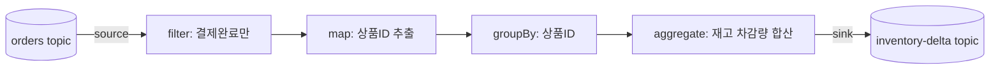

이걸 작성하는 방법은 두 가지입니다.

- **Streams DSL** (고수준): `KStream`, `KTable`에 `map`, `filter`, `aggregate`, `join` 등을 체이닝. 대부분 이걸 씁니다.
- **Processor API** (저수준): 노드를 직접 정의하고 상태 저장소를 직접 다룸. 세밀한 제어가 필요할 때.

이 글은 DSL 중심으로 갑니다.

### 3.2 KStream vs KTable — 가장 중요한 구분

Kafka Streams를 이해하는 열쇠는 **스트림-테이블 이중성(stream-table duality)** 입니다. 이 둘의 차이를 이해하지 못하면 Kafka Streams를 제대로 쓸 수 없습니다.

**KStream — 이벤트의 흐름 (record stream).** **삽입(insert) 시맨틱**을 가진, 끝없이 이어지는 레코드의 흐름입니다. 같은 키의 레코드가 또 와도 이전 것을 덮어쓰지 않습니다. 각 레코드는 독립적인 사실(fact)입니다.

```
("user-1", 주문 100원)
("user-1", 주문 300원)   ← 앞의 100원을 지우지 않음. 두 번의 주문이 다 일어난 것.
```

주문 이벤트, 클릭 로그, 결제 발생 같은 "일어난 일"은 KStream으로 모델링합니다.

**KTable — 키별 최신 상태 (changelog stream).** **갱신(upsert) 시맨틱**을 가진, 키별 최신값의 스냅샷입니다. 같은 키의 레코드가 또 오면 이전 값을 덮어씁니다. 데이터베이스의 테이블 한 행을 떠올리면 됩니다.

```
("product-1", 재고 50)
("product-1", 재고 47)   ← 47이 product-1의 현재 상태. 50은 더 이상 의미 없음.
```

상품 재고, 사용자 프로필, 환율처럼 "현재 상태"는 KTable로 모델링합니다.

같은 데이터라도 해석이 완전히 다릅니다.

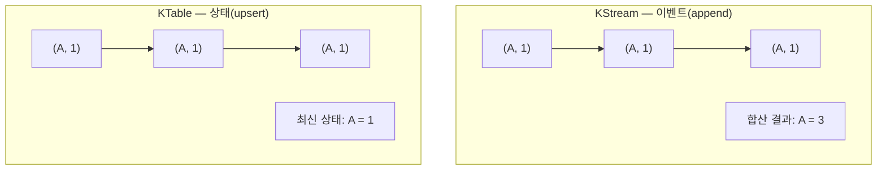

> **핵심 직관**: KStream은 "무슨 일이 일어났는가", KTable은 "지금 상태가 무엇인가". **스트림을 키별로 집계하면 테이블이 되고, 테이블의 변경 이력을 펼치면 스트림이 됩니다** (`stream.toTable()`, `table.toStream()`). 이 둘은 같은 데이터를 보는 두 가지 관점입니다.

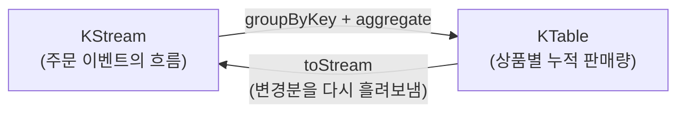

### 3.3 GlobalKTable

`KTable`은 파티션별로 나뉘어 각 인스턴스가 자기 파티션 데이터만 가집니다. 반면 `GlobalKTable`은 **모든 파티션의 데이터를 모든 인스턴스가 통째로 복제**해서 가집니다. 따라서:

- 작은 참조 데이터(코드 테이블, 상품 메타데이터 등)에 적합
- 조인 시 **co-partitioning 제약이 없다** (6절에서 다룸)
- 모든 인스턴스가 전체를 들고 있어야 하므로 큰 데이터에는 부적합

### 3.4 Stateless vs Stateful 연산

Kafka Streams의 연산은 크게 두 부류입니다.

**Stateless(상태 없음)** — 레코드 하나를 보고 바로 결정할 수 있는 연산. 과거를 기억할 필요가 없습니다.

- `filter`, `map`, `mapValues`, `flatMap`, `branch`, `peek`, `foreach`

**Stateful(상태 있음)** — 여러 레코드에 걸친 정보를 누적해야 하는 연산. 내부적으로 **상태 저장소(state store)** 가 필요합니다.

- `aggregate`, `reduce`, `count`, 각종 `join`, 윈도우 연산

stateless 연산만 쓴다면 사실 컨슈머와 큰 차이가 없습니다. Kafka Streams의 진짜 가치는 stateful 연산에서 나옵니다.

## 4. 내부 아키텍처 — Thread, Task, State Store

### 4.1 Thread, Task, Partition

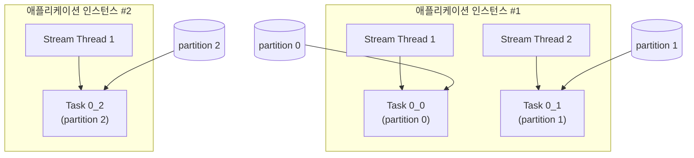

핵심 규칙:

1. **Task 수 = 입력 토픽의 파티션 수**. 파티션 3개면 Task도 3개다. 이게 병렬성의 상한이다.
2. **Task는 Stream Thread에 분배**된다. 한 스레드는 여러 Task를 처리할 수 있지만, 한 Task가 여러 스레드에 쪼개지진 않는다. 한 인스턴스 안의 병렬성은 `num.stream.threads`로 조절한다.
3. **인스턴스를 늘리면 Task가 인스턴스 간 재분배**된다. 이게 Kafka Streams의 스케일 아웃 방식이다 — Consumer Group의 리밸런싱과 동일한 메커니즘이다.

> 따라서 파티션이 3개면 인스턴스를 4개 띄워도 1개는 놀게 됩니다(다만 standby로는 쓸모 있음). **파티션 수 설계가 곧 처리량의 상한**입니다.

### 4.2 State Store와 Changelog Topic — 장애 복구의 핵심

상품별 판매량을 집계하려면 "지금까지 product-1이 몇 개 팔렸는지"를 어딘가에 기억해야 합니다. Kafka Streams는 이를 위해 각 인스턴스에 **로컬 상태 저장소**를 둡니다. 기본 구현은 **RocksDB**(디스크 기반 임베디드 KV 스토어)입니다.

여기서 자연스러운 의문: "로컬 디스크에 두면, 인스턴스가 죽거나 다른 인스턴스로 파티션이 옮겨가면 상태는 어떻게 되나?"

답이 바로 Kafka Streams의 가장 우아한 부분입니다. **모든 상태 저장소는 카프카의 changelog 토픽으로 자동 백업됩니다.**

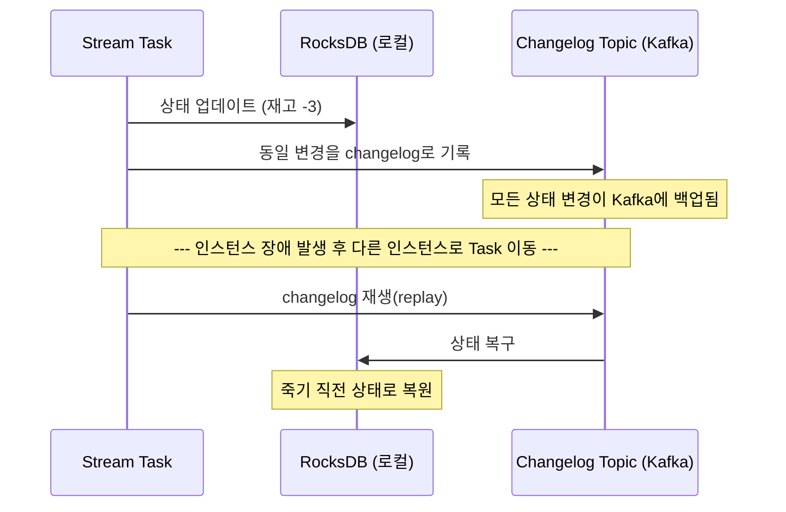

- 상태가 바뀔 때마다 그 변경분이 changelog 토픽(`<app-id>-<store-name>-changelog`)에 기록됩니다.
- 이 토픽은 **log compaction**이 적용되어 키별 최신값만 영속적으로 보관하므로 무한히 커지지 않습니다.
- 인스턴스가 죽거나 파티션이 다른 인스턴스로 재배치되면, 새 인스턴스가 changelog를 재생(replay)해서 로컬 상태를 그대로 복원합니다.

즉 로컬 디스크는 빠른 읽기용 캐시이고, **진실의 원천(source of truth)은 카프카 토픽**입니다. 컨슈머로 직접 짤 때 그렇게 골치 아팠던 "상태 영속화 + 정확한 복구"가 프레임워크 차원에서 해결됩니다.

### 4.3 Standby Replica — 복구 시간 단축

위 복구 과정은 changelog가 크면 수 분이 걸릴 수 있습니다. 이 동안 해당 파티션의 처리가 멈춥니다. 이를 줄이려면 `num.standby.replicas`를 설정합니다. 스탠바이 레플리카는 다른 인스턴스에서 changelog를 **미리 따라가며 warm state**를 유지하므로, 장애 시 거의 즉시 처리를 이어받을 수 있습니다.

```properties
num.standby.replicas=1
```

> 운영 관점에서 가용성이 중요한 토폴로지라면 standby replica는 거의 필수입니다. RTO(복구 목표 시간)를 크게 줄여줍니다.

## 5. 시간과 윈도우

스트림은 무한합니다. "최근 1분간 카테고리별 판매량" 같은 집계를 하려면 무한한 스트림을 유한한 **윈도우**로 잘라야 하고, 그러려면 시간 개념부터 명확히 해야 합니다.

**어떤 시각을 기준으로 하나?**

- **Event time**: 이벤트가 실제로 발생한 시각 (레코드에 박힌 타임스탬프). 보통 이걸 원합니다.
- **Processing time**: Streams 앱이 그 레코드를 처리한 시각.
- **Ingestion time**: 브로커가 레코드를 받은 시각.

`TimestampExtractor`로 어떤 타임스탬프를 쓸지 정합니다.

**윈도우 종류**

| 윈도우 종류 | 설명 | 예시 |
|------------|------|------|
| Tumbling | 겹치지 않는 고정 크기 | 매 1분 단위 집계 |
| Hopping | 겹칠 수 있는 고정 크기 (advance < size) | 1분 윈도우를 10초마다 |
| Sliding | 레코드 타임스탬프 차이 기준 | 실시간 비교/상관 |
| Session | 비활동 간격(gap)으로 구분 | 사용자 세션 단위 행동 분석 |

```mermaid
gantt
    title Tumbling vs Hopping (Window size = 1분)
    dateFormat  HH:mm:ss
    axisFormat %H:%M:%S
    section Tumbling
    W1 :00:00:00, 1m
    W2 :00:01:00, 1m
    W3 :00:02:00, 1m
    section Hopping (advance 30s)
    H1 :00:00:00, 1m
    H2 :00:00:30, 1m
    H3 :00:01:00, 1m
```

### 5.1 늦게 도착한 데이터 — Grace Period

분산 시스템에서 이벤트는 **순서가 뒤바뀌거나 늦게** 도착합니다. 이벤트 타임 기준으로 윈도우를 닫았는데, 네트워크 지연 등으로 그 윈도우에 속하는 이벤트가 뒤늦게 도착할 수 있습니다. `grace` 기간을 설정해 "이만큼 늦게까지는 받아준다"를 정합니다. grace 안에 도착한 늦은 이벤트는 윈도우에 반영되고, 그 이후 도착한 건 버려집니다.

### 5.2 Suppress — 최종 결과만 내보내기

윈도우 집계는 기본적으로 매 업데이트마다 중간 결과를 방출합니다. "윈도우가 완전히 닫혔을 때 최종값 하나만" 원한다면 `suppress`를 씁니다.

```kotlin
.windowedBy(TimeWindows.ofSizeAndGrace(Duration.ofMinutes(1), Duration.ofSeconds(10)))
.count()
.suppress(Suppressed.untilWindowCloses(Suppressed.BufferConfig.unbounded()))
```

> 다운스트림에 알림/정산 같은 "한 번만 일어나야 하는" 동작이 붙어 있다면 suppress가 중요합니다. 중간 결과가 새어 나가면 중복 알림이 발생합니다.

## 6. 파티셔닝, Co-partitioning, Repartition

여기는 컨슈머 경험이 그대로 통하는 부분이자, 동시에 새로 신경 써야 하는 부분입니다.

stateful 연산(집계, 조인)은 "같은 키는 같은 인스턴스가 처리한다"는 전제 위에서 동작합니다. 그래야 그 키의 상태를 로컬에서 모을 수 있으니까요. 이를 위해 두 가지 규칙이 있습니다.

**(1) 키를 바꾸면 repartition이 일어난다** — `selectKey`나 `map`으로 키를 바꾼 뒤 집계/조인을 하면, Kafka Streams는 새 키 기준으로 데이터를 다시 분배하기 위해 **내부 repartition 토픽**을 자동으로 만들어 데이터를 한 번 더 흘려보냅니다. 공짜가 아니므로(네트워크 + 토픽 I/O), 불필요한 키 변경은 피하는 게 좋습니다.

**(2) 조인하려면 co-partitioning이 맞아야 한다** — 조인하는 두 KStream/KTable은 다음을 만족해야 합니다.

1. 같은 키를 사용
2. **같은 파티션 수**
3. 같은 파티셔닝 전략

이유는 명확합니다. 조인은 Task 단위(=파티션 단위)로 일어나므로, 같은 키가 양쪽에서 같은 파티션(같은 Task)에 있어야 만납니다.

```mermaid
graph TB
    subgraph 정상["co-partitioned ✅"]
        OA["orders P0: key=A"] --> J0["Task 0"]
        PA["payments P0: key=A"] --> J0
    end
    subgraph 문제["NOT co-partitioned ❌"]
        OB["orders P0: key=A"] --> J1["Task 0"]
        PB["payments P1: key=A"] --> J2["Task 1"]
        J1 -.x.- J2
    end
```

파티션 수가 다르면 같은 키 A가 서로 다른 Task에 들어가 영영 못 만납니다. 해결책은 조인 전에 한쪽을 `repartition`(또는 `selectKey` 후 자동 리파티션)하는 것. 단, 이는 추가 토픽과 네트워크 비용을 유발합니다.

> **GlobalKTable과의 조인은 co-partitioning이 필요 없습니다.** 전체가 복제되어 있기 때문입니다. 작은 참조 데이터 조인에 GlobalKTable이 유용한 이유입니다.

## 7. 정확히 한 번(Exactly-Once Semantics)

컨슈머로 직접 짤 때 가장 어려웠던 부분이 한 줄 설정으로 끝납니다. "소비 → 처리 → 상태 갱신 → 생산"이 한 사이클인데, 중간에 죽으면 일부만 적용되어 **중복 처리나 상태 불일치**가 생기는 게 문제였죠.

```properties
processing.guarantee=exactly_once_v2
```

내부적으로는:

1. **Producer의 트랜잭션(transactional producer)** — 출력 토픽 쓰기와 컨슈머 오프셋 커밋, changelog 쓰기를 **하나의 원자적 트랜잭션**으로 묶는다.
2. **Idempotent Producer** — 재시도로 인한 중복 쓰기를 시퀀스 번호로 차단한다.

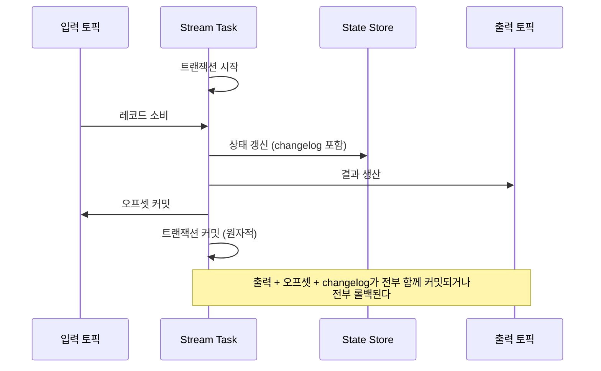

처리 중간에 죽어도, 트랜잭션이 커밋되지 않았다면 통째로 롤백되어 중복이 발생하지 않습니다.

> 주의: EOS의 "exactly-once"는 **Kafka 토픽과 Streams의 상태 저장소 안**에 한정됩니다. 외부 DB나 외부 API 호출까지 묶어주지는 않습니다. 외부 시스템과의 일관성은 여전히 Outbox 패턴이나 멱등성 설계가 필요합니다. (`exactly_once`는 deprecated이므로 신규 개발은 `exactly_once_v2`를 씁니다.) 브로커 레벨에서 이게 어떻게 동작하는지는 3부 12절에서 깊게 다룹니다.

## 8. 실전 예제 — Kotlin + Spring

spring-kafka는 Kafka Streams를 깔끔하게 통합해줍니다.

### 8.1 설정

```kotlin
@Configuration
@EnableKafkaStreams
class KafkaStreamsConfig {

    @Bean(name = [KafkaStreamsDefaultConfiguration.DEFAULT_STREAMS_CONFIG_BEAN_NAME])
    fun kStreamsConfig(): KafkaStreamsConfiguration {
        val props = mapOf(
            StreamsConfig.APPLICATION_ID_CONFIG to "inventory-aggregator",
            StreamsConfig.BOOTSTRAP_SERVERS_CONFIG to "localhost:9092",
            StreamsConfig.DEFAULT_KEY_SERDE_CLASS_CONFIG to Serdes.String().javaClass.name,
            StreamsConfig.PROCESSING_GUARANTEE_CONFIG to StreamsConfig.EXACTLY_ONCE_V2,
        )
        return KafkaStreamsConfiguration(props)
    }
}
```

또는 application.yml로:

```properties
spring.kafka.streams.application-id=inventory-aggregator
spring.kafka.streams.properties.processing.guarantee=exactly_once_v2
spring.kafka.streams.properties.num.standby.replicas=1
spring.kafka.streams.properties.num.stream.threads=2
```

> `application.id`는 컨슈머 그룹 ID이자 내부 토픽 이름의 접두사 역할을 합니다. 사실상 이 스트림 앱의 정체성이므로 신중히 정합니다.

### 8.2 윈도우 집계 — 실시간 재고 차감 집계

결제 완료된 주문 이벤트를 받아, 상품별 차감 수량을 1분 윈도우로 집계해 다운스트림에 흘려보내는 토폴로지입니다.

```kotlin
@Bean
fun inventoryTopology(builder: StreamsBuilder): KStream<String, OrderEvent> {
    val orders: KStream<String, OrderEvent> =
        builder.stream(
            "orders",
            Consumed.with(Serdes.String(), orderEventSerde())
        )

    orders
        // 1. 결제 완료 이벤트만 통과 (stateless)
        .filter { _, order -> order.status == OrderStatus.PAID }
        // 2. 키를 상품ID로 재설정 → 자동 리파티션 발생
        .selectKey { _, order -> order.productId }
        // 3. 상품ID로 그룹핑
        .groupByKey(
            Grouped.with(Serdes.String(), orderEventSerde())
        )
        // 4. 1분 텀블링 윈도우 + 10초 grace
        .windowedBy(
            TimeWindows.ofSizeAndGrace(
                Duration.ofMinutes(1),
                Duration.ofSeconds(10)
            )
        )
        // 5. 차감 수량 누적 (stateful → RocksDB + changelog)
        .aggregate(
            { 0L },
            { _, order, acc -> acc + order.quantity },
            Materialized.with(Serdes.String(), Serdes.Long())
        )
        // 6. 윈도우가 닫힐 때 최종값만 방출
        .suppress(
            Suppressed.untilWindowCloses(
                Suppressed.BufferConfig.unbounded()
            )
        )
        .toStream()
        .map { windowedKey, total ->
            KeyValue(
                windowedKey.key(),
                InventoryDelta(windowedKey.key(), total, windowedKey.window().end())
            )
        }
        // 7. 결과를 출력 토픽으로
        .to(
            "inventory-delta",
            Produced.with(Serdes.String(), inventoryDeltaSerde())
        )

    return orders
}
```

이 토폴로지의 동작을 정리하면:

- `filter`, `selectKey`, `map`은 **stateless** — 상태를 갖지 않는다.
- `aggregate`는 **stateful** — RocksDB에 상태를 쌓고 changelog로 백업한다.
- `selectKey` 직후 그룹핑/집계가 오므로 Kafka Streams가 **자동으로 리파티션 토픽**을 생성한다 (집계 키 기준으로 데이터를 다시 분배해야 같은 상품이 같은 Task에 모이므로).
- EOS 설정으로 "소비-집계-생산"이 원자적으로 처리된다.

### 8.3 조인 — 주문에 상품 메타데이터 붙이기

```kotlin
@Bean
fun enrichedOrders(builder: StreamsBuilder): KStream<String, EnrichedOrder> {
    val orders: KStream<String, OrderEvent> =
        builder.stream("orders", Consumed.with(Serdes.String(), JsonSerde(OrderEvent::class.java)))

    // 상품 메타데이터는 작고 어떤 키로든 조인하고 싶으므로 GlobalKTable
    val products: GlobalKTable<String, ProductInfo> =
        builder.globalTable("products", Consumed.with(Serdes.String(), JsonSerde(ProductInfo::class.java)))

    val enriched = orders.join(
        products,
        { _, order -> order.productId },              // 주문에서 조인 키 추출
        { order, product -> EnrichedOrder(order, product) }, // 결합 로직
    )

    enriched.to("enriched-orders", Produced.with(Serdes.String(), JsonSerde(EnrichedOrder::class.java)))
    return enriched
}
```

`@KafkaListener`로 같은 걸 하려 했다면 상품 캐시 관리, 캐시 갱신, 키 룩업을 직접 짰어야 합니다. 여기서는 `GlobalKTable`이 그 역할을 전부 대신합니다.

---

# 3부 — 내부 동작: 레코드 하나가 흘러가는 경로를 따라서

2부까지의 개념(KStream/KTable, Topology, State Store, EOS)은 추상화입니다. "그래서 레코드 하나가 들어오면 내부에서 실제로 무슨 일이 벌어지는가?"는 그 뒤에 숨어 있죠. DSL은 `filter`, `aggregate`, `to` 같은 함수 호출처럼 보이지만, 그 아래에서는 **단일 스레드가 무한 루프를 돌며 레코드를 한 건씩 밀어 넣는 매우 구체적인 기계**가 돌아갑니다. 이해가 막히는 지점은 대부분 "추상화를 글자 그대로 믿어서" 생기므로, 한 단계 아래로 내려가 봅시다.

## 9. 가장 큰 오해부터: "스트림은 동시에 흐른다"가 아니다

Topology 다이어그램을 보면 여러 프로세서 노드가 병렬로 동시에 돌아갈 것 같습니다. **아닙니다.** 하나의 Task 안에서 처리는 철저히 **순차적·단일 스레드**입니다.

StreamThread의 핵심은 사실상 이 루프입니다 (의사 코드로 단순화):

```text
while (running) {
    records = consumer.poll(timeout)          // ① Kafka에서 레코드 배치를 가져온다
    for (task in assignedTasks) {
        task.addRecords(records)              // ② 각 Task의 입력 큐에 레코드를 채운다
    }
    while (more work to do) {
        task = selectNextTask()               // ③ 처리할 Task 하나 고른다
        record = task.nextRecord()            // ④ 큐에서 레코드 한 건 꺼낸다
        task.process(record)                  // ⑤ 토폴로지 전체를 그 레코드로 한 번 관통
    }
    maybePunctuate()                          // ⑥ 시간 기반 콜백
    maybeCommit()                             // ⑦ 주기적으로 오프셋/상태 커밋
}
```

여기서 가장 중요한 통찰:

> `task.process(record)` 한 번이 **레코드 하나를 소스부터 싱크까지 토폴로지 전체에 깊이 우선(depth-first)으로 통과시킨다.** 여러 레코드가 파이프라인을 동시에 흐르는 게 아니다. 한 레코드가 끝까지 간 다음, 그 다음 레코드를 꺼낸다.

이게 왜 중요한가? **순서 보장**과 **상태 일관성**이 여기서 나옵니다. 한 레코드가 토폴로지를 관통하는 동안 그 레코드는 State Store를 읽고 쓰는데, 다른 레코드가 끼어들지 않으므로 락 없이도 일관성이 유지됩니다. 동시성 문제를 프레임워크가 "병렬을 포기하는 대신 파티션으로 쪼개는" 방식으로 우회한 것입니다.

## 10. 레코드의 물리적 여정

`orders` 토픽의 레코드 하나가 들어와서 결과가 `inventory-delta`로 나가기까지를 한 호흡으로 따라가 봅시다.

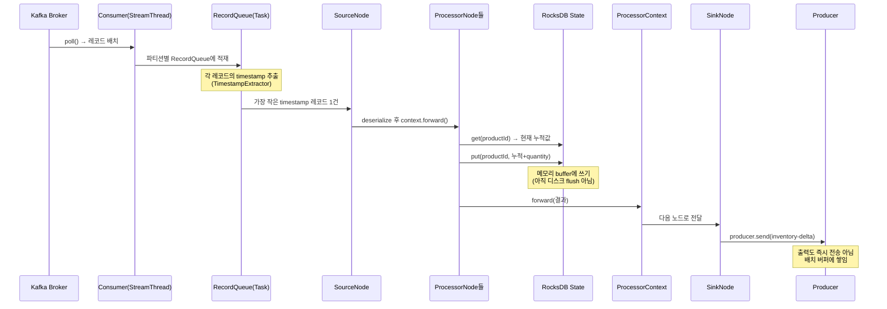

여기서 초보자가 놓치는 세 가지:

1. **레코드를 큐에서 꺼낼 때 오프셋 순서가 아니라 timestamp 순서로 고른다.** 여러 입력 파티션이 한 Task에 묶이면, Task는 각 파티션 큐의 head 중 **가장 작은 timestamp**를 가진 레코드를 다음으로 처리한다. 이걸 *stream time synchronization* 이라 한다.

2. **`context.forward()`가 핵심 동사다.** 한 노드가 처리를 끝내면 결과를 직접 반환하는 게 아니라 `forward()`로 자식 노드에게 밀어 넘긴다. 토폴로지는 이 forward의 연쇄다. 한 노드가 0건, 1건, N건을 forward할 수 있다 (filter는 0 또는 1, flatMap은 N).

3. **State Store의 `put()`은 즉시 디스크에 안 쓴다.** RocksDB의 in-memory memtable에 쓰고, changelog용 레코드는 Producer 버퍼에 쌓인다. 실제 영속화는 commit 시점에 일어난다 (11절).

### 10.1 Stream Time은 시계가 아니다

윈도우 집계나 grace period 같은 "시간" 개념의 정체도 저수준에서 보면 명확합니다. Kafka Streams에서 **stream time = "지금까지 본 레코드 중 가장 큰 timestamp"** 입니다. 벽시계(wall-clock)가 아닙니다. 레코드가 안 들어오면 stream time은 **전진하지 않습니다.**

```text
처리한 레코드 timestamp: 10:00:01, 10:00:03, 10:00:02, 10:00:08
stream time 변화:        10:00:01 → 10:00:03 → 10:00:03 → 10:00:08
                                           ↑ 과거 레코드는 stream time을 되돌리지 않음
```

이 정의에서 직접 따라 나오는 결과들:

- **윈도우가 닫히는 시점** = stream time이 `윈도우 끝 + grace`를 넘어선 순간. 새 레코드가 안 들어오면 윈도우는 영영 안 닫힌다.
- 그래서 트래픽이 끊긴 토픽의 마지막 윈도우는 다음 레코드가 올 때까지 결과가 안 나온다. (운영 중 "왜 마지막 집계가 안 나오죠?"의 단골 원인)
- **늦게 온 레코드(out-of-order)** 판정: `레코드 timestamp < stream time - grace` 이면 버려진다.

### 10.2 Punctuator — 두 가지 시간 축

`process()` 흐름과 별개로, 주기적으로 콜백을 실행하는 게 Punctuator입니다. 두 타입이 있습니다.

| 타입 | 기준 | 특징 |
|------|------|------|
| `STREAM_TIME` | stream time 전진 | 레코드가 안 오면 안 불림 |
| `WALL_CLOCK_TIME` | 실제 벽시계 | 레코드와 무관하게 불림 |

```kotlin
context.schedule(
    Duration.ofSeconds(30),
    PunctuationType.WALL_CLOCK_TIME
) { timestamp ->
    // 30초마다 무조건 실행 — 예: 타임아웃된 미완료 주문 정리
    cleanupStaleOrders(timestamp)
}
```

> 핵심: 데이터가 끊겨도 동작해야 하는 로직(타임아웃, 헬스 시그널)은 `WALL_CLOCK_TIME`을, 데이터 진행에 맞춰 동작할 로직(윈도우 마감)은 `STREAM_TIME`을 씁니다. 이 구분을 모르면 "왜 punctuator가 안 불리지?"로 헤맵니다.

## 11. Commit — 한 사이클이 "확정"되는 순간

`maybeCommit()`은 `commit.interval.ms`(기본 EOS에서 100ms, 비EOS 30초)마다 호출됩니다. commit은 단순히 오프셋을 저장하는 게 아니라 **그 주기 동안 한 일 전체를 영속화하는 동기화 지점**입니다.

비EOS(at-least-once)에서 commit이 하는 일을 순서대로 보면:

```mermaid
sequenceDiagram
    participant Thread as StreamThread
    participant Prod as Producer
    participant CL as Changelog Topic
    participant RDB as RocksDB
    participant Out as Output Topic
    participant Off as __consumer_offsets

    Note over Thread: commit.interval.ms 도래
    Thread->>Prod: producer.flush()
    Prod->>Out: 버퍼링된 출력 레코드 전송 완료 대기
    Prod->>CL: 버퍼링된 changelog 레코드 전송 완료 대기
    Note over Prod,CL: 여기서 ack 다 받을 때까지 블록
    Thread->>RDB: state store flush (memtable → SST)
    Thread->>Off: 입력 오프셋 커밋
    Note over Off: "여기까지 처리 완료" 영구 기록
```

순서가 의도적입니다. **출력과 changelog를 먼저 broker에 확정시킨 뒤에 입력 오프셋을 커밋**합니다. 만약 순서가 반대라면(오프셋 먼저 커밋), 출력 전송 전에 죽었을 때 그 레코드는 "처리됨"으로 찍혔는데 결과는 없는 **유실**이 됩니다. 이 순서가 at-least-once를 보장합니다 — 죽으면 마지막 commit 이후 레코드를 **다시** 처리하므로 중복은 생길 수 있어도 유실은 없습니다.

> 그래서 비EOS에서는 같은 출력이 두 번 나갈 수 있습니다(중복). 이걸 원천 차단하는 게 다음 절의 EOS입니다.

## 12. Exactly-Once를 브로커 레벨에서 까보기

7절에선 "트랜잭션으로 묶는다"고만 했습니다. 실제로 어떻게 원자성이 보장되는지 프로토콜 수준에서 봅시다. EOS의 핵심 부품은 셋입니다.

### 12.1 transactional.id와 Producer Fencing

각 Task는 고유한 `transactional.id`(보통 `app-id-taskId` 형태)를 가진 트랜잭셔널 프로듀서를 씁니다. 프로듀서가 broker(Transaction Coordinator)에 등록될 때 **producer epoch**(단조 증가 정수)를 받습니다.

좀비 인스턴스 문제를 이걸로 막습니다. GC 멈춤 등으로 죽은 줄 알았던 인스턴스가 되살아나 같은 `transactional.id`로 쓰기를 시도하면:

```text
인스턴스 A: transactional.id=T1, epoch=5  ← 좀비
인스턴스 B: transactional.id=T1, epoch=6  ← 새로 받은 Task

→ Coordinator는 epoch=6만 유효로 본다.
→ 좀비 A의 epoch=5 쓰기는 ProducerFencedException으로 거부.
```

이게 **fencing**입니다. "Task는 한 순간 하나의 활성 writer만 갖는다"를 broker가 강제합니다.

### 12.2 한 트랜잭션에 묶이는 것들

EOS 한 사이클에서 다음이 **하나의 트랜잭션**으로 atomic하게 커밋됩니다.

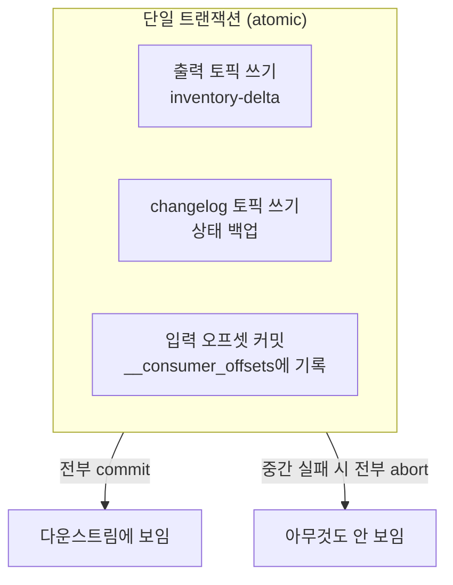

여기서 흥미로운 점: **오프셋 커밋조차 트랜잭션 안에 들어갑니다.** EOS에서 컨슈머 오프셋은 일반 commit이 아니라 `producer.sendOffsetsToTransaction()`으로 트랜잭션에 포함시킵니다. 그래서 "출력 + 상태 + 진행 위치"가 운명을 같이합니다.

### 12.3 Read Committed와 Control Record

트랜잭션이 진행 중인 레코드는 출력 토픽에 물리적으로는 이미 써져 있습니다. 그럼 다운스트림 컨슈머가 미완료 트랜잭션의 레코드를 읽으면 안 되는데, 어떻게 막을까요?

- 트랜잭션이 commit/abort되면 broker가 파티션에 **control record**(commit/abort 마커)를 기록한다.
- 다운스트림 컨슈머는 `isolation.level=read_committed`로 동작한다 (EOS Streams 앱 간에는 자동).
- read_committed 컨슈머는 **LSO(Last Stable Offset)** — 아직 미완료 트랜잭션이 없는 지점 — 까지만 읽는다. abort된 트랜잭션의 레코드는 건너뛴다.

```text
파티션 로그:  [r1][r2][TX시작 r3][r4][?]  ...
                              ↑ LSO 여기
read_committed 컨슈머는 r2까지만 보임.
r3,r4는 commit 마커가 찍혀야 비로소 보임.
```

> 이래서 EOS는 **end-to-end 지연이 늘어납니다.** 다운스트림은 트랜잭션이 닫혀야 보이므로, `commit.interval.ms`가 곧 추가 지연이 됩니다. EOS 기본 commit 간격이 100ms로 짧게 잡힌 이유입니다.

### 12.4 그래서 EOS의 경계는 명확하다

이 구조를 이해하면 7절에서 강조한 한계가 자연스럽습니다. 트랜잭션은 **Kafka broker가 관장하는 쓰기**(토픽, 오프셋, changelog)에만 미칩니다. `process()` 안에서 호출한 외부 DB INSERT나 REST 호출은 이 트랜잭션 바깥입니다. 외부 시스템과의 원자성은 여전히 Outbox/멱등성으로 따로 설계해야 합니다.

## 13. State 복구를 저수준에서

4.2절에서 "changelog를 replay해서 복구한다"고 했습니다. 실제 메커니즘을 보면 더 정밀합니다.

State Store에는 **checkpoint 파일**이 있습니다. 로컬 RocksDB가 changelog의 어느 오프셋까지 반영했는지 기록합니다.

```text
.checkpoint 파일 내용 (개념):
  store: inventory-store
  changelog-partition: 2
  offset: 48211
```

복구 시나리오:

- **정상 재시작 (로컬 상태 살아있음)**: checkpoint 오프셋부터 changelog의 끝까지만 따라잡으면 된다. 빠르다.
- **로컬 상태 소실 (새 인스턴스/디스크 날아감)**: checkpoint가 없으므로 changelog를 **처음부터 전부 replay**. log compaction 덕에 키별 최신값만 남아 있어 무한히 크진 않지만, 데이터가 많으면 수 분 걸린다. 이 동안 해당 Task는 처리 정지.
- **Standby replica가 있을 때**: standby가 다른 인스턴스에서 changelog를 미리 따라가며 RocksDB를 warm하게 유지. 장애 시 거의 즉시 active로 승격.

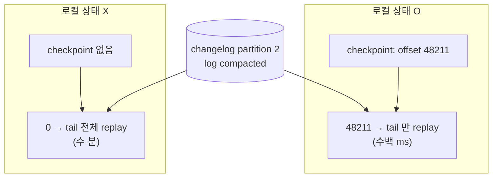

> 운영 함의: **checkpoint를 살릴 수 있으면 살려야 합니다.** Pod 재시작 시 RocksDB 디렉토리를 PV(persistent volume)에 두면 full restore를 피합니다. 컨테이너 환경에서 이걸 놓치면 매 배포마다 full restore가 돌아 다운타임이 길어집니다.

## 14. 전체를 한 장으로

레코드 하나가 들어와 결과가 확정되기까지, 모든 부품이 어디서 개입하는지:

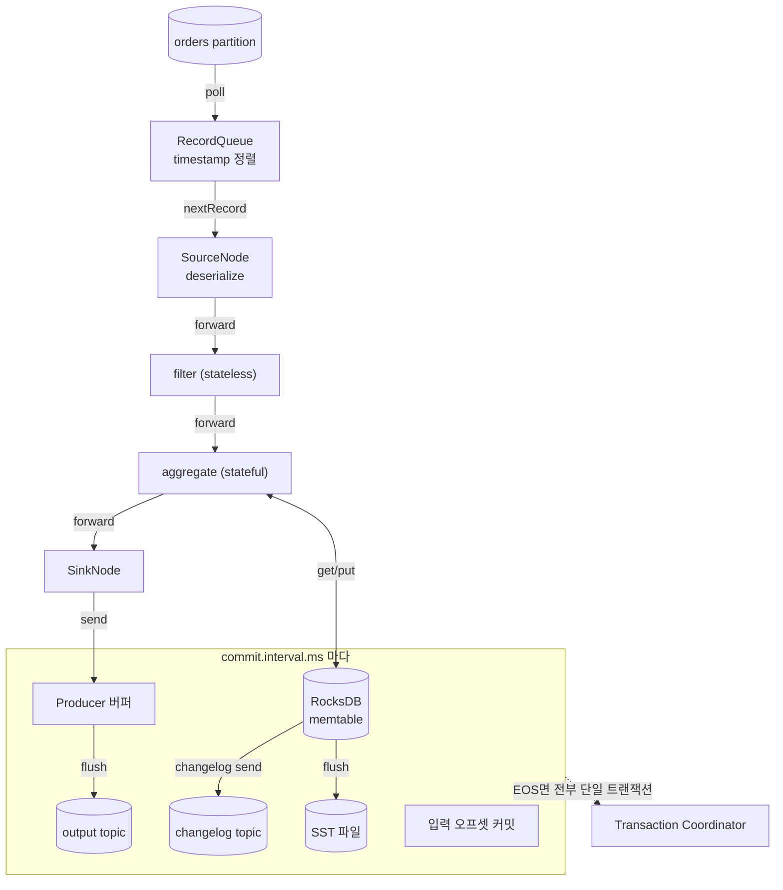

처리는 단일 스레드로 순차적이고, State는 메모리에 먼저 쌓였다가 commit 시점에 broker(changelog)와 디스크(SST)로 동시에 영속화되며, EOS면 이 전체가 하나의 트랜잭션으로 묶여 fencing과 control record로 보호된다 — 이게 한 문장 요약입니다.

---

# 운영 체크리스트

실무 투입 전 반드시 짚어야 할 것들:

- **파티션 수 = 병렬성 상한**. 처리량 요구사항에서 역산해 미리 충분히 잡아라. 나중에 늘리면 키 분배가 깨져 stateful 집계에 문제가 생길 수 있다.
- **State Store 크기 모니터링**. RocksDB는 로컬 디스크를 쓴다. 디스크 용량·I/O와 changelog 토픽 retention(특히 compaction 정책)을 함께 봐야 한다.
- **리밸런싱 비용**. 인스턴스가 추가/제거되면 Task가 이동하며 changelog 기반 상태 복구가 일어나고, 이 복구 시간이 곧 처리 중단 시간이 된다. standby replica + `static membership`(`group.instance.id`)으로 불필요한 리밸런싱을 줄여라. 컨테이너 환경이라면 RocksDB 디렉토리를 PV에 둬 checkpoint를 살려라.
- **내부 토픽 인지**. repartition 토픽, changelog 토픽이 자동 생성된다. 운영/모니터링 시 이 토픽들의 존재와 보존 정책을 알고 있어야 한다.
- **Serde 일관성**. Producer와 Streams 앱의 직렬화 포맷(Avro + Schema Registry 권장)을 맞춰야 한다. 스키마 진화 정책도 함께 설계한다.
- **DLQ 전략**. 역직렬화 실패 등 처리 불가능한 레코드를 어떻게 다룰지 (`DeserializationExceptionHandler`) 정해 둬라. 기본은 `LogAndFail`이라 메시지 하나가 전체를 멈출 수 있다.
- **EOS의 한계 인지**. 외부 DB·API와의 일관성은 EOS가 보장하지 않는다. 멱등성·Outbox로 보완한다.

---

# 마치며

Kafka Streams의 본질은 **"Kafka를 데이터베이스의 commit log처럼 다루면서, 상태를 가진 스트림 처리를 별도 인프라 없이 애플리케이션 안에서 수행한다"** 는 데 있습니다. 정리하면:

- **상태 관리**: 로컬 RocksDB + changelog 토픽으로 빠르면서도 영속적인 상태
- **장애 복구**: changelog 재생(+ checkpoint)으로 상태를 그대로 복원, standby로 가속
- **정확히 한 번**: 설정 한 줄로 read-process-write 원자성 (내부는 트랜잭션 + fencing + control record)
- **시간/윈도우/조인**: 직접 짜기 까다로운 것들을 1급 연산으로 제공
- **스케일링**: Task-Partition 매핑 기반, 컨슈머 그룹 메커니즘 그대로

그리고 이 모든 것이 **별도 클러스터 없이, 평소 쓰던 Spring Boot 애플리케이션 안에서** 돌아갑니다.

내부 동작 관점에서 다시 요약하면: **단일 스레드가 레코드를 한 건씩 토폴로지에 통째로 밀어 넣고**, 시간은 레코드의 timestamp가 정의하며, "확정"은 commit이라는 명시적 동기화 지점에서만 일어납니다. EOS는 그 commit을 broker 트랜잭션으로 감싼 것이고, 복구는 changelog와 checkpoint의 조합으로 일어납니다. 추상화는 이 저수준 동작을 편하게 쓰라고 덮어둔 껍데기이지, 마법이 아닙니다.

"컨슈머로도 되긴 하는데 점점 복잡해진다" 싶은 지점이 보이면, 그게 Kafka Streams를 꺼내야 할 신호입니다. 반대로 단순한 메시지 처리(상태 없음, 윈도우 없음)라면 굳이 도입할 이유는 없습니다 — 도구는 문제에 맞춰 고르는 것이니까요.

---

### 더 깊이 파고들 주제

- Processor API로 직접 토폴로지 짜기 — `context.forward()`와 Punctuator를 손으로 제어
- Interactive Queries (상태 저장소 외부 조회)
- Avro + Schema Registry를 이용한 스키마 진화
- KSQL/ksqlDB와의 비교
- Streams 앱 테스트 전략 (TopologyTestDriver)
- Cooperative Rebalancing / Dual Write 문제
