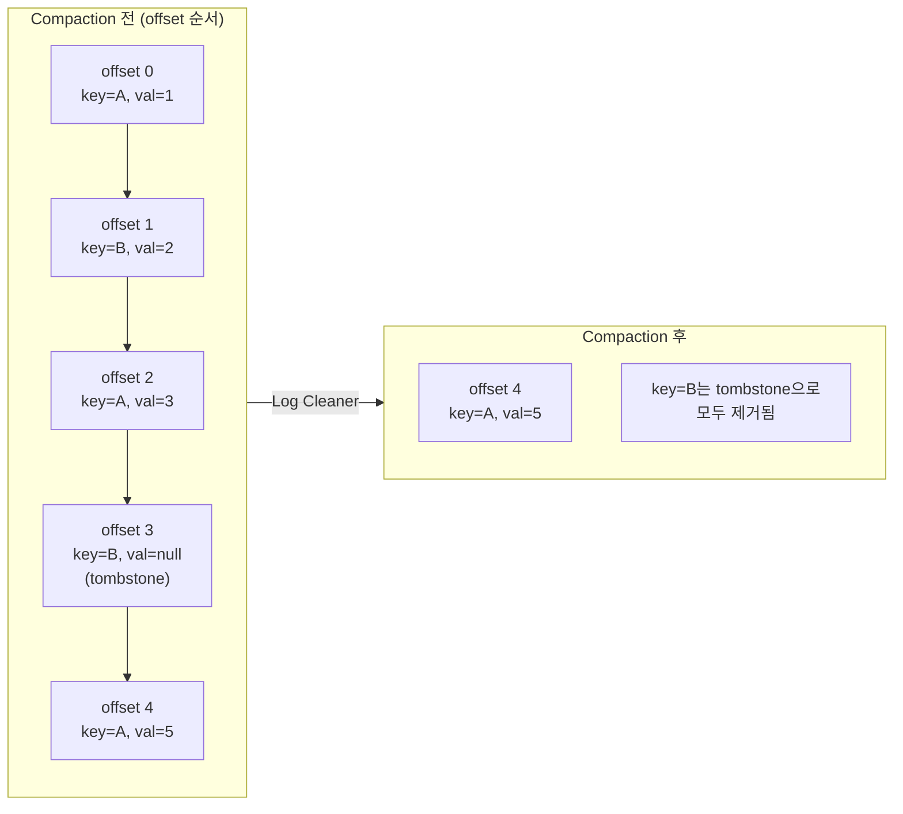

# Kafka Tombstone

## Kafka Tombstone이란?

> 카프카 Topic의 삭제 마커로 사용하기 위해 발행하는 메시지를 말한다.
> Key는 있고, valude는 null인 레코드를 말하며, `cleanup.policy=compact` 토픽에서만 작동한다.

요컨데, 발행한 메시지를 삭제할 수 없는 카프카 브로커에서 메시지를 삭제하기 위해 작동하는 메시지를 말한다. 

## Tombstone의 정의

> Tombstone은 **non-null key + null value**인 레코드.


Tombstone은 **non-null key + null value**인 레코드를 말하는 것으로, 문자열 `"null"`이나 빈 문자열이 아니라, **진짜 null인 빈 payload**여야 한다.

또 다른 조건이 하나 있는데, `cleanup.policy=compact`로 설정해준 토픽의 경우에만 툼스톤 메시지가 정상적으로 동작한다.
즉, 기본값인 `cleanup.policy=delete` 인 토픽에 value가 null인 메시지를 발행해 봤자 그냥 메시지 하나를 새로 발행한 것과 다를 바 없다.

이렇게 두 조건을 만족하는 경우엔  Kafka는 이 신호를 compaction 과정에서 사용해 같은 key의 이전 값들을 정리한다.

## Log Compaction

> Kafka의 Compact Topic은 key별로 최신 데이터 유지하는 방식의 토픽

cleanup.policy 옵션을 보면 2가지가 있는걸 확인할 수 있는데,

- `cleanup.policy=delete`로 설정된 카프카 토픽
	- 시간(`retention.ms`)·크기(`retention.bytes`) 기준으로 오래된 세그먼트를 통째로 지운다.
- `cleanup.policy=compaction`은로 설정된 카프카 토픽
	- key별로 가장 최근 값 하나만 남기고 나머지를 정리한다.
	- 전체 이벤트 히스토리가 아니라 현재 스냅샷이 필요한 경우에 쓴다.
이 중 `cleanup.policy=compaction`가 이 Log Compaction에 대한 옵션이다.




### Log Compaction의 특징

- **offset은 변경되지 않는다.**
	- compaction은 레코드를 지우기만 하고, 살아남은 레코드의 offset은 최초에 부여된 값을 그대로 유지한다. 그래서 위 그림에서 key=A의 최종값은 offset 4에 그대로 남는다.

- **compaction은 active(open) 세그먼트에는 절대 실행되지 않는다.**
	- 현재 쓰기가 진행 중인 세그먼트는 건드리지 않는다. 세그먼트가 `segment.ms`(시간) 또는 `segment.bytes`(크기) 조건으로 닫혀야 비로소 compaction 대상이 된다.
- **compaction은 "중복 0개"를 보장하지 않는다.**
	- 보장되는 것은 *tail까지 다 읽은 consumer는 각 key의 최신 값을 반드시 본다*는 점이다. head(dirty) 영역에는 아직 정리되지 않은 옛 값이 남아 있을 수 있으므로, consumer 로직은 **같은 key가 여러 번 올 수 있다**는 전제로 idempotent하게 짜야 한다. compaction은 파티션 단위로 동작하며 파티션 내 순서는 유지된다.


### Log Compaction의 장단점
#### 장점
- **최신 상태 유지**: 특정 키에 대한 최신 상태를 유지할 수 있어서 상태 저장(State Store) 용도로 적합
- **디스크 사용량 절감**: 오래된 중복 값이 제거되어서 용량 압박이 훨씬 덜해진다.
- **빠른 초기 적재**: consumer가 처음부터 읽어도 중복 이력을 다 훑지 않으므로, 캐시/머티리얼라이즈드 뷰를 빠르게 복원할 수 있다.

### 단점
- **이전 데이터 복구 불가**: 같은 키에 대해 과거 데이터가 삭제되므로, 과거 기록을 유지해야 하는 경우에는 권장되지 않는다
- **컴팩션 프로세스의 비동기성**: 로그 컴팩션은 백그라운드에서 주기적으로 실행되므로, 특정 키에 대한 삭제 요청이 즉시 반영되지 않고, 세그먼트가 닫히고 삭제될 때까지 기다려야 한다.


## 주의할점

> [!WARNING]
> `delete.retention.ms`은 모든 컨슈머가 확인할 수 있도록 넉넉하게 잡아야 한다.
> 이 값은 토픽 데이터 보관 기간이 아니라 tomstone을 얼마나 오래 남겨줄 것이냐에 대한 값이다.

`delete.retention.ms`는 토픽 데이터 보관 기간이 아니라, tombstone을 얼마나 오래 남겨둘 것이냐에 대한 값이다.
그래서 기본 값도 `86400000`. 즉, 1일로 상당히 긴 편이다.

이런 식으로 굳이 툼스톤을 오랫동안 남겨두는 이유는 Kafka는 메세지를 받자마자 지우는게 아니라, 해당 세그먼트를 닫고 난 이후에야 compaction을 실행한다.
즉, 미리미리 지워버리면 처리가 늦거나 컨슈머는 툼스톤이 삭제된 것을 파악하지 못하고 데이터가 여전히 있는걸로 생각하고, 해당 키를 삭제하지 못한다.


## 핵심 설정 정리

| 설정                             | 기본값              | 의미                                                    |
| ------------------------------ | ---------------- | ----------------------------------------------------- |
| `cleanup.policy`               | `delete`         | `compact`(또는 `compact,delete`)여야 tombstone이 삭제 마커로 동작 |
| `delete.retention.ms`          | `86400000` (1일)  | tombstone을 남겨두는 기간 = 컨슈머가 삭제를 인지할 수 있는 시간 창           |
| `min.cleanable.dirty.ratio`    | `0.5`            | dirty 비율이 이 값을 넘어야 compaction 트리거                     |
| `segment.ms` / `segment.bytes` | 7일 / 1GB         | 세그먼트가 닫혀야 compaction 대상이 됨 (active 세그먼트는 제외)          |
| `min.compaction.lag.ms`        | `0`              | 레코드가 최소 이 시간 동안은 compaction 대상에서 제외                   |
| `max.compaction.lag.ms`        | `Long.MAX_VALUE` | 이 시간이 지나면 dirty ratio와 무관하게 반드시 compaction 대상이 됨      |


## 4. Kotlin / Spring 구현

### 4-1. Tombstone 발행하기

`ProducerRecord`의 value에 **`null`을 넣는 것**이다. `KafkaTemplate`에도 value를 null로 전달하면 된다.

```kotlin
@Service
class UserProfileProducer(
    private val kafkaTemplate: KafkaTemplate<String, ByteArray?>,
) {
    private val topic = "user-profiles"

    /** 프로필 갱신: 같은 key로 덮어쓰면 compaction이 이전 값을 정리한다 */
    fun update(userId: String, payload: ByteArray) {
        kafkaTemplate.send(topic, userId, payload)
    }

    /** 삭제: value = null 인 tombstone 발행 */
    fun delete(userId: String) {
        // ProducerRecord(topic, key, value=null)
        kafkaTemplate.send(topic, userId, null)
    }
}
```

> ⚠️ 직렬화 함정: JSON 직렬화기를 쓸 때 `null`을 `"null"` 문자열이나 `{}`로 바꿔버리면 tombstone이 아니다. value serializer가 null을 그대로 null 바이트로 흘려보내는지 확인해야 한다. (Spring Kafka의 `JsonSerializer`는 null을 null로 처리한다.)

### Consumer의 Tombstone 처리

컨슈머 쪽에서는  value가 null로 들어오기 때문에, NPE 에러를 막기 위해 막아줘야 한다.

```kotlin
@Component
class UserProfileConsumer(
    private val repository: UserProfileRepository,
) {
    @KafkaListener(topics = ["user-profiles"], groupId = "profile-sync")
    fun consume(record: ConsumerRecord<String, ByteArray?>) {
        val userId = record.key()
        val value = record.value()

        if (value == null) {
            // tombstone → 로컬 상태에서도 삭제
            repository.deleteById(userId)
            return
        }
        repository.upsert(userId, deserialize(value))
    }
}
```

Kafka Streams의 경우에는 크게 신경 쓸 필요가 없는데, `KTable`에서 null value는 곧 "해당 key 삭제"로 해석된다.

```kotlin
val table: KTable<String, UserProfile> =
    builder.table("user-profiles", /* Consumed... */)
// key=user1, value=null 이 들어오면 KTable에서 user1이 사라진다.
// KTable의 changelog 토픽 자체도 내부적으로 compaction 토픽이다.
```


## 참고 문헌
- [Apache Kafka Documentation — Log Compaction](https://kafka.apache.org/43/design/design/#log-compaction)
- [Log Compaction, Message Compression](https://mystudylab.tistory.com/191)
- [Kafka Connect, ksqlDB, and Kafka Tombstone](https://rmoff.net/2020/11/03/kafka-connect-ksqldb-and-kafka-tombstone-messages/)
