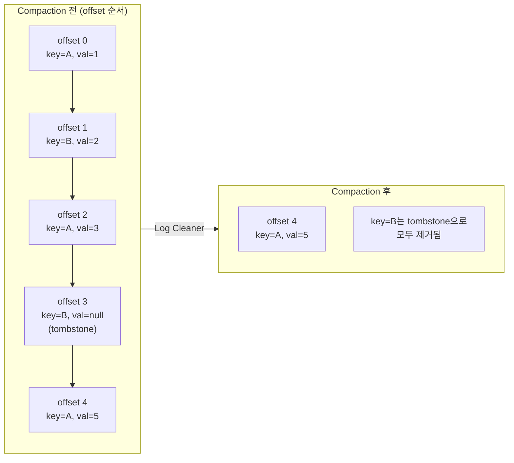

# Kafka Tombstone

## Kafka Tombstone이란?

> 카프카 Topic의 삭제 마커로 사용하기 위해 발행하는 메시지를 말한다.
> Key는 있고, valude는 null인 레코드를 말하며, `cleanup.policy=compact` 토픽에서만 작동한다.

요컨데, 발행한 메시지를 삭제할 수 없는 카프카 브로커에서 메시지를 삭제하기 위해 작동하는 메시지를 말한다. 

## Tombstone의 정의

> Tombstone은 **non-null key + null value**인 레코드.

Tombstone은 **non-null key + null value**인 레코드를 말하는 것으로, 문자열 `"null"`이나 빈 문자열이 아니라, **바이트로 진짜 null인 payload**여야 한다.

또 다른 조건이 하나 있는데, `cleanup.policy=compact`로 설정해준 토픽의 경우에만 툼스톤 메시지가 정상적으로 동작한다.
기본 값인 `cleanup.policy=delete` 인 토픽에 빈 value를 가진 메시지를 발행해 봤자 그냥 메시지 하나를 새로 발행한 것과 다를 바 없다.

이렇게 두 조건을 만족하는 경우엔  Kafka는 이 신호를 compaction 과정에서 사용해 같은 key의 이전 값들을 정리한다.

## Log Compaction
cleanup.policy 그럼 옵션을 보면 이제 2가지가 있는걸 확인할 수 있는데,

- `cleanup.policy=delete`로 설정된 카프카 토픽
	- 시간이나 크기 기준으로 오래된 세그먼트를 통째로 지운다.
- `cleanup.policy=compaction`은로 설정된 카프카 토픽
	- key별로 가장 최근 값 하나만 남기고 나머지를 정리한다.
	- 전체 이벤트 히스토리가 아니라 현재 스냅샷이 필요한 경우에 쓴다.

### offset은 변경되지 않는다.
compaction은 레코드를 지우기만 하고, 살아남은 레코드의 offset은 최초에 부여된 값을 그대로 유지한다. 그래서 위 그림에서 key=A의 최종값은 offset 4에 그대로 남는다.

### compaction은 active(open) 세그먼트에는 절대 실행되지 않는다.
현재 쓰기가 진행중인 세그먼트는 건드리지 않는다.세그먼트가 `segment.ms`(시간) 또는 `segment.bytes`(크기) 조건으로 닫혀야 비로소 compaction 대상이 된다. 로컬 테스트에서 "tombstone을 넣었는데 왜 안 지워지지?" 하는 경우 대부분 세그먼트가 아직 안 닫혔기 때문이다

### compaction 타이밍은 비결정적(non-deterministic)이다.
compaction은 dirty ratio(`min.cleanable.dirty.ratio`, 기본 0.5)가 임계치를 넘어야 트리거된다. 어느 순간에 같은 key의 레코드가 tombstone 포함 여러 개 존재할 수 있고, "언제 정리되는지"를 정확히 보장하지 않는다. 이 점이 뒤에서 나올 함정의 근원이다.

## 주의할점
> [!WARNING]
> `delete.retention.ms`은 모든 컨슈머가 확인할 수 있도록 넉넉하게 잡아야 한다.

`delete.retention.ms`는 **"토픽 데이터 보관 기간"이 아니다.** 정확히는 "tombstone(삭제 마커)을 얼마나 오래 남겨둘 것인가"이다(기본값 `86400000`. 즉, 1일).