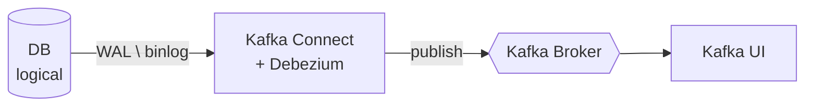

## 들어가며

## 전체 구조



각 구성 요소의 역할은 다음과 같다.

- PostgreSQL: 
  - DB.
  - WAL(Write-Ahead Log) 레벨을 Logical로 설정해 행 단위 논리적 변경 정보를 기록한다.
- Kafka Connect + Debezium: 
  - PostgreSQL의 WAL을 읽어 Kafka로 발행하는 중계자.
- Kafka: 
  - 변경 이벤트가 흐르는 메시지 브로커.
- Kafka UI: 
  - 토픽과 커넥터 상태를 시각적으로 확인하는 도구.

## Docker Compose로 로컬 환경 구축하기

우선 개념을 확인하기 전에 Docker-compose를 이용해 CDC 환경을 띄워본 이후에, 개념 이해를 하는 편이 도움이 될거 같아서 이번엔 반대로 환경부터 빌드해보도록 하겠습니다.

### 1. docker-compose.yml

```yaml
services:
  postgres:
    image: postgres:16
    container_name: postgres
    ports:
      - "5432:5432"
    environment:
      POSTGRES_USER: postgres
      POSTGRES_PASSWORD: 1241
      POSTGRES_DB: shop
    command:
      - "postgres"
      - "-c"
      # wal_level 기본값은 replica, logical로 변경 필수
      - "wal_level=logical"
      # 동시 WAL sender 프로세스 수
      - "-c"
      - "max_wal_senders=10"
      # replication slot 최대 개수
      - "-c"
      - "max_replication_slots=10"
    volumes:
      - ./postgres/init.sql:/docker-entrypoint-initdb.d/init.sql
      - postgres_data:/var/lib/postgresql/data
    healthcheck:
      test: ["CMD-SHELL", "pg_isready -U postgres -d shop"]
      interval: 5s
      retries: 10

  kafka:
    image: confluentinc/cp-kafka:7.7.0
    container_name: kafka
    ports:
      - "9092:9092"        # 서비스에서 접근하는 Port
      - "29092:29092"      # 컨테이너 간 통신용
    environment:
      KAFKA_NODE_ID: 1
      KAFKA_PROCESS_ROLES: "broker,controller"
      KAFKA_CONTROLLER_QUORUM_VOTERS: "1@kafka:9093"
      KAFKA_LISTENERS: "PLAINTEXT://0.0.0.0:29092,CONTROLLER://0.0.0.0:9093,EXTERNAL://0.0.0.0:9092"
      KAFKA_ADVERTISED_LISTENERS: "PLAINTEXT://kafka:29092,EXTERNAL://localhost:9092"
      KAFKA_LISTENER_SECURITY_PROTOCOL_MAP: "PLAINTEXT:PLAINTEXT,CONTROLLER:PLAINTEXT,EXTERNAL:PLAINTEXT"
      KAFKA_CONTROLLER_LISTENER_NAMES: "CONTROLLER"
      KAFKA_INTER_BROKER_LISTENER_NAME: "PLAINTEXT"
      KAFKA_OFFSETS_TOPIC_REPLICATION_FACTOR: 1
      KAFKA_TRANSACTION_STATE_LOG_REPLICATION_FACTOR: 1
      KAFKA_TRANSACTION_STATE_LOG_MIN_ISR: 1
      KAFKA_AUTO_CREATE_TOPICS_ENABLE: "true"
      CLUSTER_ID: "MkU3OEVBNTcwNTJENDM2Qk"
    healthcheck:
      test: ["CMD-SHELL", "kafka-topics --bootstrap-server localhost:29092 --list"]
      interval: 10s
      retries: 10

  connect:
    image: debezium/connect:2.7.3.Final
    container_name: connect
    ports:
      - "8083:8083"
    depends_on:
      kafka:
        condition: service_healthy
      postgres:
        condition: service_healthy
    environment:
      BOOTSTRAP_SERVERS: "kafka:29092"
      GROUP_ID: "1"
      CONFIG_STORAGE_TOPIC: "connect_configs"
      OFFSET_STORAGE_TOPIC: "connect_offsets"
      STATUS_STORAGE_TOPIC: "connect_statuses"
      KEY_CONVERTER: "org.apache.kafka.connect.json.JsonConverter"
      VALUE_CONVERTER: "org.apache.kafka.connect.json.JsonConverter"
      KEY_CONVERTER_SCHEMAS_ENABLE: "false"
      VALUE_CONVERTER_SCHEMAS_ENABLE: "false"

  kafka-ui:
    image: provectuslabs/kafka-ui:latest
    container_name: kafka-ui
    ports:
      - "8082:8080"
    depends_on:
      - kafka
      - connect
    environment:
      KAFKA_CLUSTERS_0_NAME: "local"
      KAFKA_CLUSTERS_0_BOOTSTRAPSERVERS: "kafka:29092"
      KAFKA_CLUSTERS_0_KAFKACONNECT_0_NAME: "connect"
      KAFKA_CLUSTERS_0_KAFKACONNECT_0_ADDRESS: "http://connect:8083"

volumes:
  postgres_data:
```

docker-compose를 이용해 postgres, kafka, debezium, kafka-ui를 동시에 띄운다.

### 2. postgres/init.sql

```sql
-- CDC 전용 유저 생성 (REPLICATION 권한 필수)
CREATE ROLE cdc_user WITH REPLICATION LOGIN PASSWORD 'cdc_pw';

-- 샘플 테이블
CREATE TABLE orders (
    id           BIGSERIAL PRIMARY KEY,
    user_id      BIGINT NOT NULL,
    status       VARCHAR(20) NOT NULL,
    total_amount NUMERIC(10, 2) NOT NULL,
    created_at   TIMESTAMP DEFAULT NOW(),
    updated_at   TIMESTAMP DEFAULT NOW()
);

-- UPDATE/DELETE 시 before 값 전체를 받기 위함
ALTER TABLE orders REPLICA IDENTITY FULL;

-- 권한 부여
GRANT SELECT ON ALL TABLES IN SCHEMA public TO cdc_user;
GRANT USAGE ON SCHEMA public TO cdc_user;

-- Debezium용 publication (어떤 테이블을 게시할지 선언)
CREATE PUBLICATION dbz_publication FOR TABLE orders;
```

Host Volume 경로가 `./postgres/init.sql` 이므로 `docker-compose.yml` 파일이 있는 디렉토리에 `postgres`를 생성해서 작업한다.

> [!NOTE]
> `init.sql`은 PostgreSQL 데이터 디렉토리가 비어있을 때만 실행된다.
> 한 번이라도 실행한 뒤 init.sql을 수정해도 반영되지 않으므로, `docker compose down -v`로 볼륨까지 삭제 후 재시작해야 하거나, 직접 쿼리를 입력해서 반영해야 한다.

### 3. connector/register-postgres.json

```json
{
  "name": "postgres-orders-connector",
  "config": {
    "connector.class": "io.debezium.connector.postgresql.PostgresConnector",
    "tasks.max": "1",
    "database.hostname": "postgres",
    "database.port": "5432",
    "database.user": "cdc_user",
    "database.password": "cdc_pw",
    "database.dbname": "shop",
    "topic.prefix": "shop",
    "plugin.name": "pgoutput",
    "publication.name": "dbz_publication",
    "slot.name": "debezium_slot",
    "table.include.list": "public.orders",
    "snapshot.mode": "initial",
    "tombstones.on.delete": "true",
    "decimal.handling.mode": "string",
    "time.precision.mode": "connect",
    "heartbeat.interval.ms": "10000"
  }
}
```

### 4. Compose up

```bash
# docker compose up
docker compose up -d

# Connect가 완전히 뜰 때까지 대기
curl http://localhost:8083/
```

### 5. Connector 등록

```bash
# Connector 등록
curl -X POST -H "Content-Type: application/json" \
  --data @connector/register-postgres.json \
  http://localhost:8083/connectors

# 상태 확인
curl http://localhost:8083/connectors/postgres-orders-connector/status

# 정상적으로 빌드가 되었다면 아래와 같이 나올 것이다.
# {"name":"postgres-orders-connector","connector":{"state":"RUNNING","worker_id":"172.18.0.4:8083"},"tasks":[{"id":0,"state":"RUNNING","worker_id":"172.18.0.4:8083"}],"type":"source"}
```

### 확인

이제 [http://localhost:8082/](http://localhost:8082/)로 이동해 Kafka UI에 접속하면 `shop.public.orders` 토픽이 생성되어있고, DB의 데이터를 수정할 시 토픽에 메시지가 추가되는 것을 확인할 수 있다.

## 동작 확인

### UPDATE 이벤트 발생시키기

먼저 INSERT로 row를 하나 만든 다음, UPDATE 이벤트를 발생시켜본다.

```bash
# 1. row 생성
docker exec -it postgres psql -U postgres -d shop -c \
  "INSERT INTO orders (user_id, status, total_amount) VALUES (1, 'PENDING', 30000);"

# 2. 금액 수정
docker exec -it postgres psql -U postgres -d shop -c \
  "UPDATE orders SET total_amount = 25000 WHERE id = 1;"
```

### Kafka 토픽에서 메시지 확인

```bash
docker exec -it kafka kafka-console-consumer \
  --bootstrap-server localhost:29092 \
  --topic shop.public.orders \
  --from-beginning
```


### 메시지

```json
{
	"before": {
		"id": 1,
		"user_id": 1,
		"status": "PENDING",
		"total_amount": "30000.00",
		"created_at": 1779244421881,
		"updated_at": 1779244421881
	},
	"after": {
		"id": 1,
		"user_id": 1,
		"status": "PENDING",
		"total_amount": "25000.00",
		"created_at": 1779244421881,
		"updated_at": 1779244421881
	},
	"source": {
		"version": "2.7.3.Final",
		"connector": "postgresql",
		"name": "shop",
		"ts_ms": 1779263717781,
		"snapshot": "false",
		"db": "shop",
		"sequence": "[\"26664864\",\"26665176\"]",
		"ts_us": 1779263717781775,
		"ts_ns": 1779263717781775000,
		"schema": "public",
		"table": "orders",
		"txId": 752,
		"lsn": 26665176,
		"xmin": null
	},
	"transaction": null,
	"op": "u",
	"ts_ms": 1779263718009,
	"ts_us": 1779263718009230,
	"ts_ns": 1779263718009230495
}
```

- `before`는 업데이트 이전 값이 들어간다.
  - `INSERT` 문이었으면 NULL
- `after`는 업데이트 이후 값이 들어간다.
  - `DELETE` 문이면 NULL
- `op`는 DML이 무엇이냐에 따라 달라진다.
  - `c` (create) — INSERT
  - `u` (update) — UPDATE
  - `d` (delete) — DELETE
  - `r` (read) — 초기 스냅샷

만약 Row를 Delete한 경우에는 `op: "d"` 메시지에 이어서 value가 비어있는 메시지(tombstone)가 한 번 더 발행된다.

### 멱등성

Debezium은 정책상 at-least-once이기 때문에, 동일한 메시지가 2번 이상 올 가능성이 있다.
-> 카프카 메시지 발행과 offset commit은 같은 트랜잭션으로 묶일 수 없는 dual-Write기 때문에 메시지 발행만 하고 offset 발행은 실패하는 경우를 대비하기 위해, 동일한 이벤트를 재전송한다.
고로, Consumer에서 반드시 멱등성 체크가 필요하다.

```kotlin
// ❌ 위험: INSERT 두 번이면 PK 충돌
repository.insert(order)

// ✅ LSN 기반 감지
if (order.lsn > existing.lsn) {
    repository.update(order)
}
```

## 라인별 해석

이제 위의 빌드 파일이 무슨 의미인지 하나하나 분석해보자.

### PostgreSQL의 설정

```yaml
command:
  - "postgres"
  - "-c"
  - "wal_level=logical"
  - "-c"
  - "max_wal_senders=10"
  - "-c"
  - "max_replication_slots=10"
```

#### WAL(Write-Ahead Log)

WAL이란 PostgreSQL의 변경 이력 로그.
모든 변경은 데이터 파일에 반영되기 전에 먼저 WAL에 기록된다. 먼저 기록하기 때문에 "Write-Ahead"이란 뜻.

원래는 데이터베이스에 문제가 생겼을 때 복구를 위해 있는 기능으로써, 다운 시 WAL을 다시 읽어옴으로써 데이터 일관성을 복구하기 위해 있는 기능이다.
즉, 이 바이너리 파일을 읽으면 DB의 이력을 파악할 수 있기 때문에, 외부에서 사용하면 동일하게 시스템 변경을 적용할 수 있다.
이것이 replication와 CDC의 원리이다.

MySQL인 경우는 binlog를 바탕으로 작성한다.

**wal_level의 3가지 값**

| 값 | WAL에 기록되는 내용 | 활용 |
|----|---------------------|------|
| `minimal` | crash recovery에 꼭 필요한 최소한 정보 | crash 복구 |
| `replica` | (기본값) 물리 replication 정보 | Streaming Replication, PITR |
| `logical` | 로우 단위 변경 정보 | CDC, Logical Replication |

**minimal**


크래시 복구에 필요한 최소 정보만 기록한다.
정말로 DB입장에서 필요한 정보만 저장하기 때문에 디코딩해서 활용하는 것이 불가능하다.

**replica**

물리 페이지의 byte 단위 변경을 다 기록한다.
레플리카 DB가 같은 byte를 수정하면 완전히 동일하게 동작한다.
-> 레플리카 DB의 원리.

**logical**

replica의 모든 정보에 더해, "이 변경이 논리적으로 무엇이었는지" 정보가 함께 들어간다.

- 어떤 테이블의 변경인지
- INSERT/UPDATE/DELETE 중 무엇인지
- 각 컬럼의 새 값 (REPLICA IDENTITY 설정에 따라 이전 값도)

CDC이 정보를 읽어서 무엇이 바뀌었는지 읽어간다.

**WAL 레벨 변경의 위험성**

1. 기록하는 정보가 많아지기 때문에 같은 쿼리도 대략 10~30% 더 많은 WAL 용량을 사용한다.
2. 대량 INSERT 시 DB가 눈에 띄게 느려진다.
3. 큰 트랜잭션은 메모리 사용 폭증.
4. 한 번 logical로 올리면 DB의 재시작이 필요하다.

#### max_wal_senders

PostgreSQL은 외부 연결마다 WAL을 보내는 전용 프로세스를 띄우게 되는데, 이 프로세스가 `wal_sender`이다.
즉, `max_wal_senders=10`은 WAL을 외부로 보내는 sender 프로세스를 최대 10개까지 띄울 수 있도록 한다는 뜻이다.
많이 늘려도 메모리를 조금 더 사용하는 정도라서 넉넉하게 10~20개 정도로 설정하는 편이 좋다.

```sql
SELECT pid, application_name, state, sync_state, 
       client_addr, backend_start
FROM pg_stat_replication;
```

|pid|application_name|state|sync_state|client_addr|backend_start|
|---|----------------|-----|----------|-----------|-------------|
|20361|Debezium Streaming|streaming|async|-.-.-.-|2026-05-20 16:29:23.659 +0900|

조회해보면 이런 식으로 나온다.

**max_connections와의 관계**

`max_wal_senders`는 커넥션 풀(max_connections)이 아니라 동시에 띄울 수 있는 WAL sender 프로세스의 최대 개수이다.
다만 추가 프로세스인 만큼 메모리는 더 사용하므로, 전체 메모리 산정 시에는 고려해야 한다.

#### max_replication_slots

`slot`이란 위치 기억 장치다.
PostgreSQL이 비휘발성 영역에 저장하는 기준점으로, "Consumer가 어디까지 확실히 읽어갔는지" 를 기록해두는 메타데이터다.

```sql
SELECT slot_name, plugin, slot_type, active, restart_lsn, confirmed_flush_lsn
FROM pg_replication_slots;
```

|slot_name|plugin|slot_type|active|restart_lsn|confirmed_flush_lsn|
|---------|------|---------|------|-----------|-------------------|
|debezium_slot|pgoutput|logical|true|0/196DCF0|0/196DFA0|

- `active`: 현재 활성 중인지 여부
- `restart_lsn`: 이 consumer가 재시작했을 때 다시 읽기 시작해야 하는 위치. 이 위치 이전의 WAL은 지워도 상관없다는 뜻.
- `confirmed_flush_lsn`: Consumer가 여기까지 받았다고 확인한 위치.

`max_replication_slots`는 동시에 존재할 수 있는 슬롯의 최대 개수다.
활성 슬롯뿐 아니라 비활성 슬롯도 포함된다. 누군가 만들어두고 안 쓰는 슬롯도 카운트된다.
모든 Consumer가 `restart_lsn`까지는 읽어야 그 이전까지의 WAL을 지워도 된다.

> [!WARNING]
> 모든 슬롯은 전부 카운트된다. 즉, 누가 만들어놓고 안 쓰는 Slot도 포함되기 때문에
> 만들어 놓고 사용을 하지 않으면 WAL이 무한정 쌓이는 부작용이 생긴다
> -> 안 쓰는 SLOT는 즉시 삭제 필수
>
> `"max_slot_wal_keep_size=10GB"`같은 식으로 설정해 둔다면, 해당 슬롯이 10GB 만큼 쌓일때까지 WAL을 안 가져갔다면 자동으로 삭제해버린다. -> 안정장치

**heartbeat**

WAL은 내가 설정하지 않아도, 전체 테이블의 WAL을 기록한다.
하지만, 그중에서 내가 필요한건 Order 밖에 없으므로 order만 사용하는데, 그럼 다른 테이블들은 처리되는게 없으므로 WAL은 만드는대로 쌓이게 된다.

이를 막기 위해 Debezium 설정에 `"heartbeat.interval.ms": "10000"`를 설정해도 참조하지 않는 테이블이라도 읽었다고 표시해서 AWL을 읽을 수 있도록 한다.

**Slot의 종류**

- Physical Slot:
  - Streaming Replication용 (standby 서버용)
  - WAL을 raw byte 그대로 전송
- Logical Slot:
  - logical decoding용 (Debezium 등)
  - WAL을 디코딩해서 row 단위 변경으로 변환

#### PostgreSQL의 프로세스 정리

```
[INSERT into orders]
       ↓
[wal_level=logical] → WAL에 "테이블=orders, op=INSERT, col=..." 정보 포함
       ↓
[max_wal_senders=10] → 외부 연결마다 WAL sender 프로세스 할당
       ↓
[Debezium이 WAL Sender 1번에 연결됨]
       ↓
[max_replication_slots=10] → debezium_slot 생성, 위치 기억
       ↓
[Debezium이 데이터 받고 ack]
       ↓
[slot의 restart_lsn 진행]
       ↓
[PostgreSQL이 restart_lsn 이전 WAL 삭제 가능]
```

### REPLICA IDENTITY의 설정

#### CDC 전용 유저 생성

```sql
CREATE ROLE cdc_user WITH REPLICATION LOGIN PASSWORD 'cdc_pw';
```

Debezium이 PostgreSQL에 접속할 때 쓸 계정을 생성.
`REPLICATION` 권한이 있어야 slot으로 WAL을 읽을 수 있다. 일반적인 권한으로는 불가.

#### REPLICA IDENTITY FULL

```sql
ALTER TABLE orders REPLICA IDENTITY FULL;
```

`REPLICA IDENTITY`는 UPDATE/DELETE 시 WAL에 이전 값(before)을 어디까지 기록할지에 대한 설정이다.

| 설정 | WAL에 기록되는 before 값 | 사용 시점 |
|------|--------------------------|-----------|
| `DEFAULT` | PK 컬럼만 | 변경 전 값이 PK만 필요한 경우 |
| `USING INDEX <index_name>` | 지정한 unique index 컬럼만 | PK 대신 자연키 unique index를 식별자로 쓸 때 |
| `FULL` | 모든 컬럼 | Debezium의 `before` 필드를 온전히 받고 싶을 때 |
| `NOTHING` | 없음 | UPDATE/DELETE의 `before`가 null로 고정. 해당 테이블이 publication에 포함되어 있으면 UPDATE/DELETE 자체가 실패함 |

- 단점: `FULL`로 바꾸면 기록되는 내용이 많아져 WAL 용량이 꽤 증가하기 때문에 꼭 필요한 테이블만 적용해야한다.

#### Publication 생성
```sql
CREATE PUBLICATION dbz_publication FOR TABLE orders;
```

```sql
CREATE PUBLICATION [publication_name] FOR TABLE [table];
```

PostgreSQL의 logical replication 개념.
즉, 해당 문장을 해석해보면 `[publication_name]`에 `[table]`의 변경 사항을 게시하겠다는 설정이다.

### Debezium의 설정

```json
{
  "name": "postgres-orders-connector",
  "config": {
    "connector.class": "io.debezium.connector.postgresql.PostgresConnector",
    "tasks.max": "1",
    "database.hostname": "postgres",
    "database.port": "5432",
    "database.user": "cdc_user",
    "database.password": "cdc_pw",
    "database.dbname": "shop",
    "topic.prefix": "shop",
    "plugin.name": "pgoutput",
    "publication.name": "dbz_publication",
    "slot.name": "debezium_slot",
    "table.include.list": "public.orders",
    "snapshot.mode": "initial",
    "tombstones.on.delete": "true",
    "decimal.handling.mode": "string",
    "time.precision.mode": "connect",
    "heartbeat.interval.ms": "10000"
  }
}
```

```
"connector.class": "io.debezium.connector.postgresql.PostgresConnector"
```

Kafka Connect 설정. 해당 커넥터를 Debezium의 PostgreSQL 커넥터로 설정한다.
MySQL이면 `io.debezium.connector.mysql.MySqlConnector`으로 설정해야 한다.

```json
"tasks.max": "1"
```

이 커넥터가 만들 수 있는 task 최대 개수. DB 소스 커넥터는 Debezium은 무조건 1이다.
하나의 replication slot에서 순차적으로만 읽어서 처리해야 하기 때문이다.

```json
"database.dbname": "shop"
```

하나의 Debezium 커넥터는 하나의 DB만 처리하기 때문에, 다른 DB도 캡처하려면 별도 커넥터와 슬롯을 추가로 만들어야 한다.

```json
"topic.prefix": "shop"
```

생성되는 Kafka 토픽 이름의 접두사. 토픽명 규칙: `{topic.prefix}.{schema}.{table}`
예: `shop.public.orders`

```json
"plugin.name": "pgoutput"
```
출력을 어떤 포멧으로 받을 것인지의 포멧, 기본값이고 설치가 필요 없어서 가장 많이 쓰인다.


```json
"publication.name": "dbz_publication"
```

PUBLICATION의 이름.

```json
"slot.name": "debezium_slot"
```

replication slot 이름.
PostgreSQL이 해당 슬롯이 어디까지 읽었는지 기록한다.

```json
"table.include.list": "public.orders"
```

- CDC 대상 테이블을 `schema.table` 형식으로 기록한다.
- 여러 개인 경우 쉼표로 넣는다. 예: `"public.orders,public.product"`

```json
"snapshot.mode": "initial"
```

- 초기 데이터 처리 방식.

| 모드 | 동작 |
|------|------|
| `initial` | 처음 시작했을 때 테이블 내 모든 row의 스냅샷을 생성한다 |
| `never` | 스키마도 데이터도 캡처하지 않는다 |
| `always` | 매번 시작 시 스냅샷 |
| `initial_only` | 스냅샷만 하고 종료 |
| `no_data` | 스키마는 캡처하되 데이터는 건너뛴다 |
| `when_needed` | 오프셋이 있으면 streaming, 없거나 무효하면 자동으로 snapshot 수행 |

이중 가장 많이 쓰이는 방식은 `initial`과 `no_data`.

- `initial`
  - 장점:
    - 데이터가 적은(수백만 건 이하) 테이블에 적합
    - 운영 중이지 않은 서비스에 적합
    - 설정이 간편하다
  - 단점:
    - 스냅샷 중에는 스트리밍 안 함
- `no_data`
  - 장점:
    - 데이터가 많은(수천만 건 이상) 테이블에 적합
    - 스냅샷 도중 다운되더라도 청크 단위로 끊어서 이어 할 수 있다
    - 운영 중인 서비스에 적합
  - 단점:
    - `debezium_signal` 테이블 생성, 청크 크기 설정 등 추가 설정이 필요
    - 진행 사항 모니터링 필수

`when_needed`은 슬롯 사고 등으로 LSN을 잃어버린 상황에서 자동으로 snapshot으로 복구되도록 할 때 쓴다.

`no_data`로 마이그레이션 하는 방법은 아래 참고.

```json
"tombstones.on.delete": "true"
```

DELETE 이벤트(`op: "d"`) 직후에 value가 null인 메시지(tombstone)를 한 번 더 발행한다.

```json
"decimal.handling.mode": "string"
```

`NUMERIC`/`DECIMAL` 어떤 타입으로 표시할 건지에 대한 값.

| 모드 | 결과 |
|------|------|
| `precise` | 기본값. Base64 인코딩된 byte 형태 |
| `string` | `"25000.00"` 문자열. **JSON 직렬화에 가장 안전** |
| `double` | Double형. 해당 데이터 타입의 고질적 문제인 정밀도 오차가 있을 수 있다 |

```json
"time.precision.mode": "connect"
```

`TIMESTAMP`/`DATE`/`TIME` 표현 방식.

| 모드 | 결과 |
|------|------|
| `adaptive` | 기본값 |
| `adaptive_time_microseconds` | TIME만 마이크로초로 표현 |
| `connect` | Kafka Connect 표준 타입(밀리초). 다른 시스템 호환성이 좋다 |

#### no_data + incremental

1. 커넥터 시작

```json
{
    "snapshot.mode": "no_data",
    "incremental.snapshot.chunk.size": "1024",
    "signal.data.collection": "public.debezium_signal"
}
```

스키마만 캡처하고, 스냅샷은 따지 않는다.

2. Debezium 커넥터 설정 업데이트

```json
{
    "connector.class": "io.debezium.connector.postgresql.PostgresConnector",
    ...
    // 아래 include.list에 새로운 테이블이 추가된다.
    "table.include.list": "public.orders,public.payments",
    // 바라볼 시그널 테이블
    "signal.data.collection": "public.debezium_signal"
}
```

3. Incremental Snapshot 트리거

```sql
-- 3. Incremental Snapshot 트리거 (payments 과거 데이터 가져오기)
INSERT INTO debezium_signal (id, type, data) VALUES (
  'snapshot-payments-001',
  'execute-snapshot',
  '{"data-collections":["public.payments"],"type":"incremental"}'
);
```
