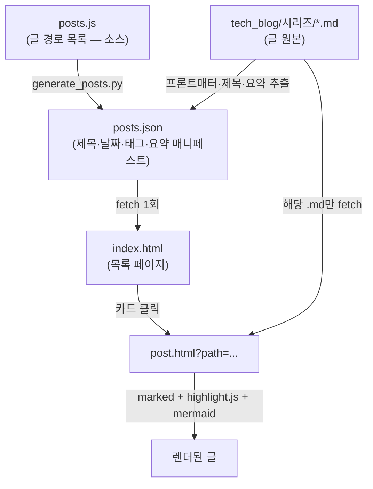

# 기술블로그 운영 매뉴얼

`tech_blog/`는 마크다운(`.md`) 파일로 글을 쓰면 정적 페이지로 보여주는 기술블로그입니다.
서버 없이 **GitHub Pages** 로 서빙되며, 별도의 프레임워크 없이 순수 HTML/CSS/JS + 파이썬 빌드 스크립트로 동작합니다.

## 목차

- [1. 아키텍처와 데이터 흐름](#1-아키텍처와-데이터-흐름)
- [2. 디렉터리 구조](#2-디렉터리-구조)
- [3. 빌드 & 배포](#3-빌드--배포)
- [4. 새 글 추가하기](#4-새-글-추가하기)
- [5. 새 시리즈 추가하기](#5-새-시리즈-추가하기)
- [6. 프론트매터 레퍼런스](#6-프론트매터-레퍼런스)
- [7. 지원하는 마크다운 문법](#7-지원하는-마크다운-문법)
- [8. 목록 정렬 규칙](#8-목록-정렬-규칙)
- [9. 로컬 미리보기](#9-로컬-미리보기)
- [10. 테스트](#10-테스트)
- [11. 트러블슈팅](#11-트러블슈팅)
- [12. 파일별 역할 요약](#12-파일별-역할-요약)

---

## 1. 아키텍처와 데이터 흐름

핵심은 **목록은 빌드된 매니페스트(`posts.json`) 하나만 읽고, 글 본문은 클릭할 때 해당 `.md`만 읽는다**는 점입니다.



- **`index.html`(목록)** 은 `posts.json` **한 개만** `fetch` 합니다. 글이 아무리 많아져도 목록 로딩 요청은 항상 1회입니다.
- **`post.html`(상세)** 은 URL의 `?path=` 에 지정된 `.md` **한 개만** `fetch` 해서 그 자리에서 마크다운을 렌더링합니다.
- `posts.json` 은 **빌드 산출물**입니다. 직접 손대지 말고 항상 `generate_posts.py`(또는 `publish.sh`)로 재생성하세요.

> [!IMPORTANT]
> `posts.js` 는 "어떤 글이 있는지"를 정하는 **소스**이고, `posts.json` 은 거기서 뽑아낸 **빌드 결과**입니다. 글을 추가/수정하면 `posts.json` 을 반드시 다시 생성해야 목록에 반영됩니다.

---

## 2. 디렉터리 구조

```
tech_blog/
├── index.html            # 목록 페이지 (posts.json 하나만 읽음)
├── post.html             # 글 상세 페이지 (해당 .md 하나만 읽음)
├── blog.css              # 전체 스타일
├── blog-common.js        # 공용 로직 (프론트매터 파싱, 렌더 전처리 등)
├── blog-common.test.js   # blog-common.js 단위 테스트 (node --test)
├── generate_posts.py     # posts.js → posts.json 빌드 스크립트
├── posts.js              # 글 경로 목록 (소스, 수동 편집)
├── posts.json            # 빌드된 매니페스트 (자동 생성, 손대지 말 것)
├── README.md             # 이 문서
├── redis/  server/  Spring/  Kafka/  ...   # 시리즈 폴더 = 글 원본 .md
└── (그 외 시리즈 폴더들)
```

배포 스크립트(`publish.sh`)와 `.nojekyll`(Jekyll 처리 비활성화)은 저장소 루트에 있습니다.

---

## 3. 빌드 & 배포

### 한 방에 배포 (권장)

저장소 루트에서:

```bash
./publish.sh                    # 기본 커밋 메시지(타임스탬프)
./publish.sh "글 추가: Kafka"     # 커밋 메시지 직접 지정
```

`publish.sh` 가 순서대로 해주는 일:

1. `python3 tech_blog/generate_posts.py` 실행 → `posts.json` 재생성
2. **사이트 파일만** 스테이징 (`tech_blog`, `index.html`, `이찬우 포트폴리오`)
3. 커밋 & `git push` → GitHub Pages 가 자동 배포

> [!WARNING]
> `publish.sh` 는 `git add -A` 를 쓰지 않고 `SITE_PATHS` 에 나열된 경로만 스테이징합니다. 개인 파일이 실수로 공개 커밋되는 것을 막기 위함입니다. **새로 커밋해야 할 사이트 파일/폴더가 생기면 `publish.sh` 의 `SITE_PATHS` 배열에 추가**하세요. (안 그러면 push 됐는데 그 파일만 빠지는 현상이 생깁니다.)

### 빌드만 (배포 없이 매니페스트만 갱신)

```bash
python3 tech_blog/generate_posts.py
```

출력 예시:

```
생성 완료: 32개 글 → posts.json

[알림] posts.js 에 없는 글(목록에 안 나옴):
  - Spring/새로쓴글.md
```

`[알림]` 은 **디스크에는 `.md` 가 있는데 `posts.js` 에는 안 적힌** 글을 알려줍니다. 목록에 띄우려면 `posts.js` 에 추가하세요.

---

## 4. 새 글 추가하기

1. **`.md` 파일 작성** — `tech_blog/<시리즈>/글제목.md`
   맨 위에 프론트매터를 넣고(→ [6장](#6-프론트매터-레퍼런스)), 첫 줄 제목은 `#` H1 으로 씁니다. 이 H1 이 글 제목이 됩니다.

   ```markdown
   ---
   created_at: 2026-07-07
   updated_at: 2026-07-07
   tags:
     - spring
     - webflux
   ---

   # WebFlux 정리

   본문 시작...
   ```

2. **`posts.js` 에 경로 등록** — `tech_blog` 폴더 기준 상대경로를 배열에 추가합니다.

   ```js
   const POSTS = [
     'redis/Redis.md',
     'Spring/WebFlux.md',   // ← 새 글 추가
   ];
   ```

   > [!CAUTION]
   > 대소문자·띄어쓰기·확장자까지 실제 파일명과 **100% 일치**해야 합니다. 하나라도 다르면 그 글만 조용히 로드 실패합니다(개발자도구 콘솔에 fetch 에러만 찍히고 화면엔 안 뜸). 배열 안 순서는 상관없습니다 — 목록은 날짜순으로 다시 정렬됩니다([8장](#8-목록-정렬-규칙)).

3. **빌드 & 배포** — `./publish.sh "글 추가: WebFlux"`

이미지 등 첨부 파일은 같은 시리즈 폴더에 두고 마크다운에서 상대경로로 참조하면 됩니다(예: ``).

---

## 5. 새 시리즈 추가하기

시리즈 = **최상위 폴더 하나**. 폴더명이 곧 시리즈 키가 됩니다.

1. **폴더 생성** — `tech_blog/<시리즈키>/` (예: `tech_blog/Database/`)
2. **`blog-common.js` 의 `SERIES_LABELS` 에 표시 이름 매핑 추가** (선택이지만 권장)

   ```js
   const SERIES_LABELS = {
     'redis': 'Redis',
     'server': 'Server',
     'Database': '데이터베이스',   // ← 폴더키 : 화면에 보일 이름
   };
   ```

   - 매핑을 안 하면 폴더명(`Database`)이 그대로 탭/라벨에 노출됩니다. 동작에는 문제없고 "예쁜 이름"만 안 붙습니다.
   - **키는 폴더명과 대소문자까지 정확히 일치**해야 합니다.
3. 그 폴더에 글(`.md`)을 넣고 → `posts.js` 에 경로 등록 → 빌드/배포. ([4장](#4-새-글-추가하기)과 동일)

시리즈 탭은 `posts.json` 에 글이 **처음 등장하는 순서**대로 만들어집니다(현재는 날짜 최신순 정렬을 따름). 특정 시리즈에 글이 하나도 없으면 탭도 안 생깁니다.

---

## 6. 프론트매터 레퍼런스

파일 맨 위에 `---` 로 감싼 YAML 블록입니다. 전부 선택 항목이지만 넣는 걸 권장합니다.

| 키 | 예시 | 설명 |
|---|---|---|
| `created_at` | `2026-07-07` | 작성일. **목록 정렬 기준**. 카드/상세에 "작성"으로 표시. |
| `updated_at` | `2026-07-07` | 수정일. `created_at` 과 다를 때만 "수정"으로 함께 표시. |
| `tags` | (아래 리스트) | 태그. 목록 페이지 좌측 태그 사이드바 필터로 쓰임. |

```yaml
---
created_at: 2026-07-07
updated_at: 2026-07-07
tags:
  - kafka
  - message-queue
---
```

파싱 규칙(간이 파서, `blog-common.js` / `generate_posts.py` 공통):

- `키: 값` 형태와, 그 아래 `  - 항목` 들여쓰기 리스트만 인식합니다.
- **제목**은 프론트매터가 아니라 본문 첫 `# H1` 에서 뽑습니다. H1 이 없으면 파일명이 제목이 됩니다.
- **요약(excerpt)** 은 본문 앞부분에서 마크다운 문법을 제거하고 약 100자로 자동 생성됩니다(직접 지정 불필요).

---

## 7. 지원하는 마크다운 문법

렌더링은 [`marked`](https://marked.js.org), 코드 하이라이트는 [`highlight.js`](https://highlightjs.org), 다이어그램은 [`mermaid`](https://mermaid.js.org)가 담당합니다. 렌더 파이프라인은 `post.html` 에 있습니다:

```
extractMermaidBlocks → fixBoldFlanking(transformCallouts(...)) → marked.parse → renderMermaidBlocks
```

### 일반 마크다운

제목, 목록, 표, 인용문, 링크, 이미지, 인라인/블록 코드 등 CommonMark 표준을 그대로 지원합니다.

### Mermaid 다이어그램

` ```mermaid ` 코드펜스로 감싸면 다이어그램으로 렌더링되고, 마우스로 **확대/이동(pan-zoom)** 됩니다.

    ```mermaid
    flowchart LR
        A --> B --> C
    ```

### GitHub 스타일 콜아웃(Alert)

인용문 첫 줄에 `[!TYPE]` 을 쓰면 강조 박스가 됩니다. 지원 타입: `NOTE`, `TIP`, `IMPORTANT`, `WARNING`, `CAUTION`.

```markdown
> [!TIP]
> 이렇게 쓰면 팁 박스로 렌더링됩니다.
```

각 타입은 GitHub과 동일한 **octicon 아이콘 + Title-case 라벨**(ⓘ Note, 💡 Tip, 🗨 Important, ⚠ Warning, ⛔ Caution)로 렌더링되며, 아이콘 색은 타입별 강조색을 따릅니다. 아이콘 정의는 `blog-common.js` 의 `CALLOUT_ICON_PATHS` 에 있습니다.

### 코드 블록

언어를 지정하면 구문 강조가 되고, 마우스를 올리면 우측 상단에 **Copy** 버튼이 나타납니다.

### 볼드 자동 보정 (신경 쓸 것 없음)

`**중간 저장소(버퍼 역할)**를` 처럼 **닫는 `**` 앞이 괄호 등 문장부호이고 바로 뒤에 한글 조사**가 붙으면, CommonMark 규칙상 볼드가 렌더링되지 않습니다. 이 블로그는 `fixBoldFlanking`(→ `blog-common.js`)가 렌더 직전에 **보이지 않는 zero-width space** 를 끼워 자동으로 고쳐줍니다.

- **원본 `.md` 는 건드리지 않습니다.** 평소처럼 `**볼드**` 로 쓰면 됩니다.
- 코드블록/인라인 코드 안의 `**` 는 보정 대상에서 제외됩니다.

---

## 8. 목록 정렬 규칙

`generate_posts.py` 가 `posts.json` 을 만들 때 **`created_at` 내림차순(최신순)** 으로 정렬합니다.

- 같은 날짜의 글들은 `posts.js` 에 적힌 **원본 순서를 유지**합니다(안정 정렬).
- `created_at` 이 없는 글은 맨 뒤로 밀립니다.
- 따라서 `posts.js` 배열의 순서는 목록 노출 순서에 영향을 주지 않습니다(같은 날짜의 tiebreak 용도로만 쓰임).

정렬 방식을 바꾸려면 `generate_posts.py` 의 다음 줄을 수정하세요:

```python
posts.sort(key=lambda p: p["date"] or "", reverse=True)
```

---

## 9. 로컬 미리보기

> [!CAUTION]
> `index.html` 을 더블클릭해 `file:///...` 로 열면 글이 하나도 안 뜹니다. 브라우저가 `file://` 스킴에서는 보안상 `fetch()` 로 로컬 파일 읽기를 차단하기 때문입니다. **반드시 로컬 HTTP 서버로 띄우세요.**

저장소 **루트**에서:

```bash
python3 -m http.server 8000
# 브라우저: http://localhost:8000/tech_blog/index.html
```

또는 `npx serve .`, 또는 VS Code 의 "Live Server" 확장.

GitHub Pages 에 push 하면 자동으로 `https://` 로 서빙되므로 배포 후에는 이 문제가 없습니다.

---

## 10. 테스트

`blog-common.js` 의 순수 함수들(프론트매터 파싱, 요약 추출, mermaid/콜아웃 전처리, 볼드 보정 등)에 대한 단위 테스트가 있습니다. 별도 의존성 없이 Node 내장 러너로 돌아갑니다.

```bash
node tech_blog/blog-common.test.js
```

`blog-common.js` 의 로직을 고치면 이 테스트를 먼저 확인하세요. 새 전처리 로직을 추가할 때는 테스트도 함께 추가하는 것을 권장합니다.

---

## 11. 트러블슈팅

| 증상 | 원인 / 해결 |
|---|---|
| 로컬에서 글이 하나도 안 뜸 | `file://` 로 열었을 가능성. 로컬 HTTP 서버로 띄우기([9장](#9-로컬-미리보기)). |
| 특정 글만 목록/상세에서 안 뜸 | `posts.js` 경로와 실제 파일명 불일치(대소문자·띄어쓰기·확장자). 개발자도구 콘솔의 fetch 에러 확인. |
| 새 글을 추가했는데 목록에 안 나옴 | `generate_posts.py`(또는 `publish.sh`) 를 안 돌려서 `posts.json` 이 갱신 안 됨. 또는 `posts.js` 에 경로 미등록(빌드 시 `[알림]` 확인). |
| 시리즈 탭 이름이 폴더명 그대로 나옴 | `SERIES_LABELS` 에 매핑 미추가([5장](#5-새-시리즈-추가하기)). |
| 볼드/굵게가 `**` 그대로 보임 | 대부분 자동 보정됨. 안 되면 `**` 짝이 안 맞거나 사이에 줄바꿈이 있는지 확인. |
| push 했는데 특정 파일이 배포 안 됨 | `publish.sh` 의 `SITE_PATHS` 에 그 경로가 없음. 배열에 추가. |
| 다이어그램이 코드블록으로만 보임 | 코드펜스 언어가 `mermaid` 인지 확인(` ```mermaid `). |

---

## 12. 파일별 역할 요약

| 파일 | 역할 | 수동 편집? |
|---|---|---|
| `posts.js` | 글 경로 목록(소스) | ✅ 글 추가 시 편집 |
| `posts.json` | 빌드된 매니페스트 | ❌ 자동 생성 |
| `generate_posts.py` | `posts.js` → `posts.json` 빌드 | 로직 변경 시만 |
| `index.html` | 목록 페이지 | UI 변경 시만 |
| `post.html` | 글 상세 페이지 / 렌더 파이프라인 | UI·렌더 변경 시만 |
| `blog-common.js` | 공용 로직(파싱·전처리), `SERIES_LABELS` | 시리즈/로직 추가 시 |
| `blog.css` | 스타일 | 디자인 변경 시 |
| `../publish.sh` | 빌드 + 커밋 + push | 새 사이트 경로 추가 시 |
