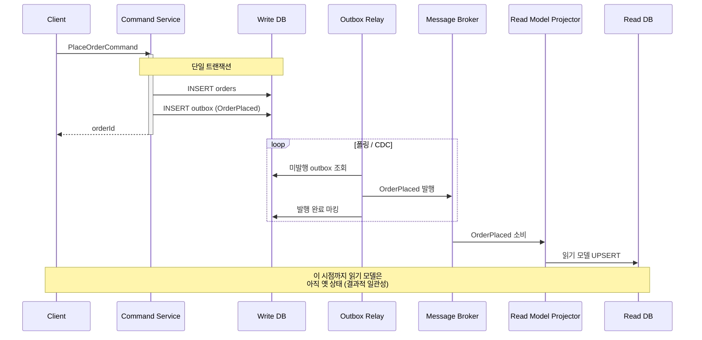
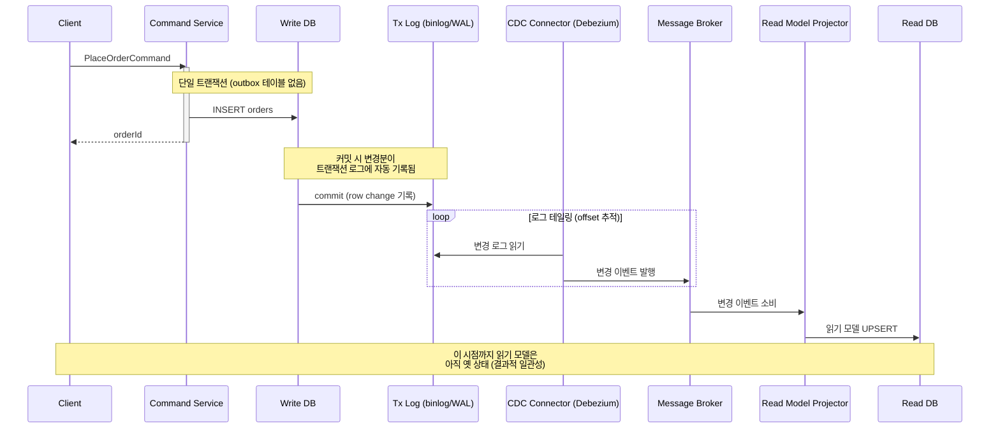

# CQRS

## CQRS란

> **CQRS(Command Query Responsibility Segregation)는 상태를 변경하는 모델(Command)과 상태를 조회하는 모델(Query)을 분리하는 패턴**이다.

보통 읽기와 쓰기는 사용 횟수도 다르고 사용 방식도 다르다.
보통 상품 같은 경우는 조회는 초당 수십건도 나오지만, 해당 상품을 수정하는 부분은 거의 주에 한두번이 나올까 말까한다. 그런 경우에 읽기를 늘린다고 레플리카 DB를 늘려봤자. 읽기가 같이 커넥션 풀을 점거하고 있어서 생각보다 빨라지지 않는다.

원칙상으로는 아예 읽기용 DB모델, 읽기용 서버, 쓰기용 DB 모델, 쓰기용 DB 이런식으로 나누는거지만, 부하가 그렇게 크지 않은 회사 입장에서는 그정도까지는 필요 없고, 그냥 프로그램 단에서 서비스 레이어나 레포지토리 레이어를 Coomand와 Query 양측으로 분리해서 관리 편의성을 높힌다.

## 도입 이유
**정규화를 많이 할수록 쓰기는 더 쉬워지지만, 읽기는 더 어려워져 전체 읽기 성능에 영향을 미치게 된다.**

## CQRS 단계
### 코드레벨 분리
대부분의 소규모 사이트에서는 이정도만 해도 충분하고, 내가 이 문서를 쓰기로한 동기가 되는 부분이다.
저장소를 그대로 하나만 쓰되, 코드 레벨에서  Command 경로와 Query 경로를 분리한다.

-  Command: 도메인 모델 → 리포지토리 → 트랜잭션, 불변식 검증
- Query: 화면 전용 DTO를 네이티브 쿼리/프로젝션으로 직접 조회 (도메인 엔티티를 거치지 않음)

이것만으로도 조회용 코드와 도메인 모델 코드를 분리할 수 있어서 대부분의 소규모 서비스애선 이정도만 해도 된다.

### 저장소 분리

읽기와 쓰기를 물리적으로 분리한다. 쓰기는 정규화된 DB에 작성하고, 읽기는 비정규환된 DB에서 읽어온다.
즉, 유저가 글을 썼을 때 포스트는 RDB에 작성하고, 읽기는 Elasticsearch에서 읽어오는 형식의 시스템 구조를 말한다.

이때, 두 DB를 연결해서 동기화 시키는 방법으로 **이벤트 기반 동기화 / Outbox 패턴 / CDC**가 그대로 등장한다.

## 구현

생각보다 복잡하지 않다. 그냥 정말로 읽기와 쓰기를 분리하는 것이다.

### Command
```kotlin
@Service
class OrderCommandService(
    private val orderRepository: OrderRepository,
    private val couponService: CouponService,
) {
    @Transactional
    fun placeOrder(command: PlaceOrderCommand): Long {
        // 도메인 모델을 통해 불변식을 지킨다
        val order = Order.create(command.userId, command.items)

        command.couponId?.let { couponId ->
            val coupon = couponService.use(couponId, command.userId)
            order.applyDiscount(coupon) // 도메인 로직이 응집된 풍부한 모델
        }

        return orderRepository.save(order).id
    }
    
        @Transactional
    fun changeItems(command: ChangeOrderItemsCommand) {
        // 읽기 프로젝션이 아니라 쓰기용 애그리거트를 로드한다
        val order = orderRepository.findByIdAndUserId(command.orderId, command.userId)
            ?: throw OrderNotFoundException(command.orderId)

        // 불변식은 도메인 모델 안에서 지킨다 (배송 시작 후 변경 불가 등)
        order.changeItems(command.items)

        // JPA 더티 체킹이 UPDATE를 수행하므로 별도 save 호출이 필요 없다.
        // 읽기 모델 동기화를 위해 변경 이벤트를 발행한다 (레벨 2로 이어지는 지점)
        eventPublisher.publishEvent(OrderItemsChangedEvent.from(order))
    }
}
```

Command는 상태를 바꾸는 일만 한다. 반환값도 식별자 정도로 최소화 시킨다.
수정도 읽기 전용 레포지토리가 아니라 쓰기 전용 레포지토리에서 가져와서 수정한다.

### Query 측
```kotlin
@Transactional(readOnly = true)
@Service
class OrderQueryService(
    private val orderQueryRepository: OrderQueryRepository,
    private val orderItemQueryRepository: OrderItemQueryRepository,
) {
    
    fun getOrderListByUserId(userId: Long): List<OrderListDto> {
        val OrderListDtos = OrderQueryRepository.findByUserId(userId)
        // 1:N 데이터는 IN 절 배치로 한 번에 모아 N+1과 중복 행을 동시에 피한다
        val orderItems = orderItemQueryRepository
            .findByOrderId(OrderListDtos.map { it.orderId })
            .groupBy { it.orderId }

        return orderItems ...
    }
}
```
uery 측은 **도메인 엔티티를 거치지 않는다.** 쓰기용 `OrderRepository`와는 별개의 읽기 전용 리포지토리를 두고, 엔티티가 아니라 화면 전용 DTO로 바로 프로젝션한다. 여기서 핵심은 _"리포지토리를 쓰느냐 SQL을 직접 쓰느냐"_ 가 아니라, **읽기 경로가 쓰기용 도메인 모델과 분리되어 있느냐**다.


### 저장소 분리시의 동기화
WriteDB가 업데이트 됬을때, ReadDB도 같이 시켜줘야 한다.
이때, 대표적으로 2가지의 방식으로 할 수 있다.
1. outbox 패청
2. CDC 패턴
즉, 핵심은 DB에 쓰기와 이벤트 발행을 원자적으로 묶는 것이 주된 관심사가 된다.

#### outbox




#### CDC


### 단점
이런 구조다 보니 필연적으로 OutBox와 CDC가 가지고 있는 결과적 일관성을 공유한다.

ACID 에서 I를 뺀 ACD만 구성하는 것이다.
 결과적으로 딜레이가 생길 수 있다. 
 이건 설계상 받아들여야 하는 특성이다.

## 도입 시기
1. 읽기와 쓰기의 트래픽이 극단적으로 다르다
	1. 예를 들면 하루 쓰기 1~2건, 일기 100건
2. 조회 관계가 너무 복잡해서 join으로 할때는 성능이 느려지는 경우
3. 감사 로그·이력 추적이 도메인 요구사항이다.

## 참고 문헌
- [CQRS(명령 쿼리 책임 분리) 패턴](https://learn.microsoft.com/ko-kr/azure/architecture/patterns/cqrs)
- [CQRS 패턴 완벽 가이드: 읽기와 쓰기 분리로 애플리케이션 성능 극대화하기](https://lhr0419.medium.com/%EB%8D%B0%EC%9D%B4%ED%84%B0-%EC%9D%BD%EA%B8%B0%EC%99%80-%EC%93%B0%EA%B8%B0%EB%A5%BC-%EB%B6%84%EB%A6%AC%ED%95%98%EB%8A%94-%EB%A7%88%EB%B2%95-cqrs-%ED%8C%A8%ED%84%B4-feat-%EB%B3%B5%EC%9E%A1%EC%84%B1-%ED%95%B4%EC%86%8C-3534df421f86)
- [Spring Boot를 사용하여 CQRS 패턴 알아보기](https://chinkl.tistory.com/entry/MSA-Spring-Boot%EB%A5%BC-%EC%82%AC%EC%9A%A9%ED%95%98%EC%97%AC-CQRS-%ED%8C%A8%ED%84%B4-%EC%95%8C%EC%95%84%EB%B3%B4%EA%B8%B0)
- [CQRS 이해하기](https://velog.io/@suzhanlee/CQRS-%EC%9D%B4%ED%95%B4%ED%95%98%EA%B8%B0)