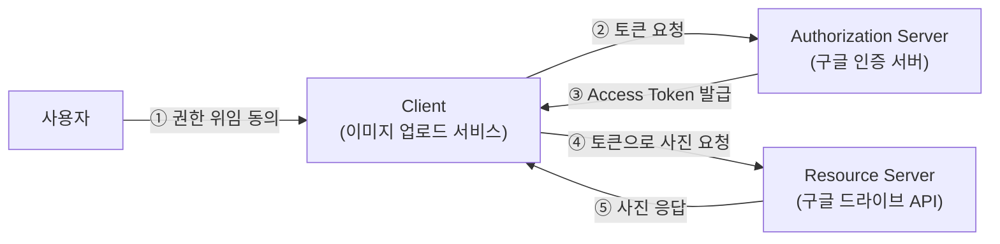
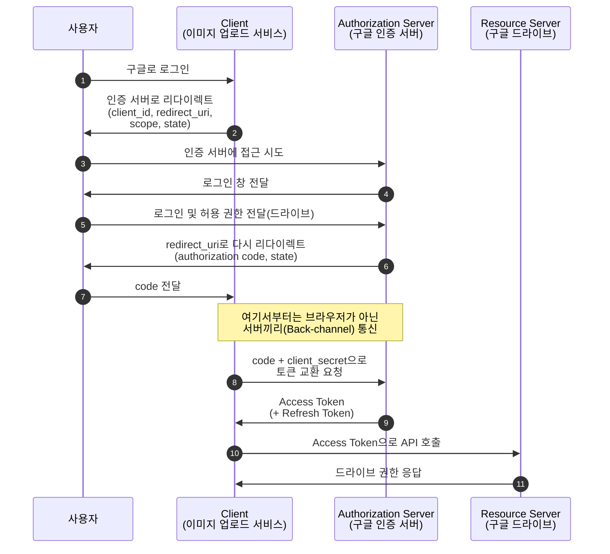
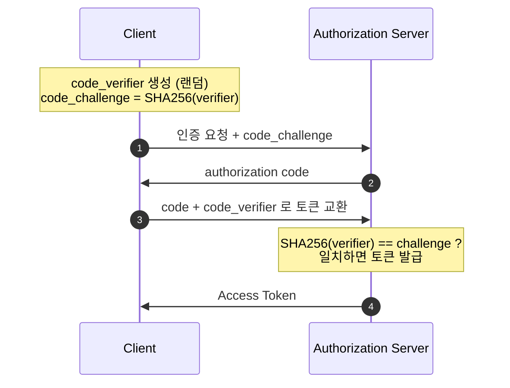
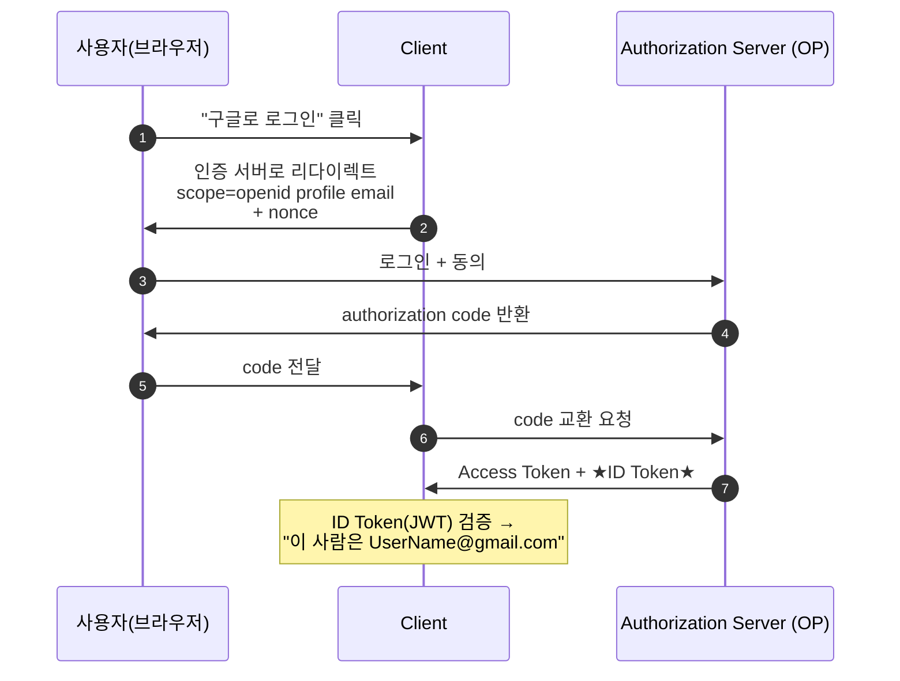
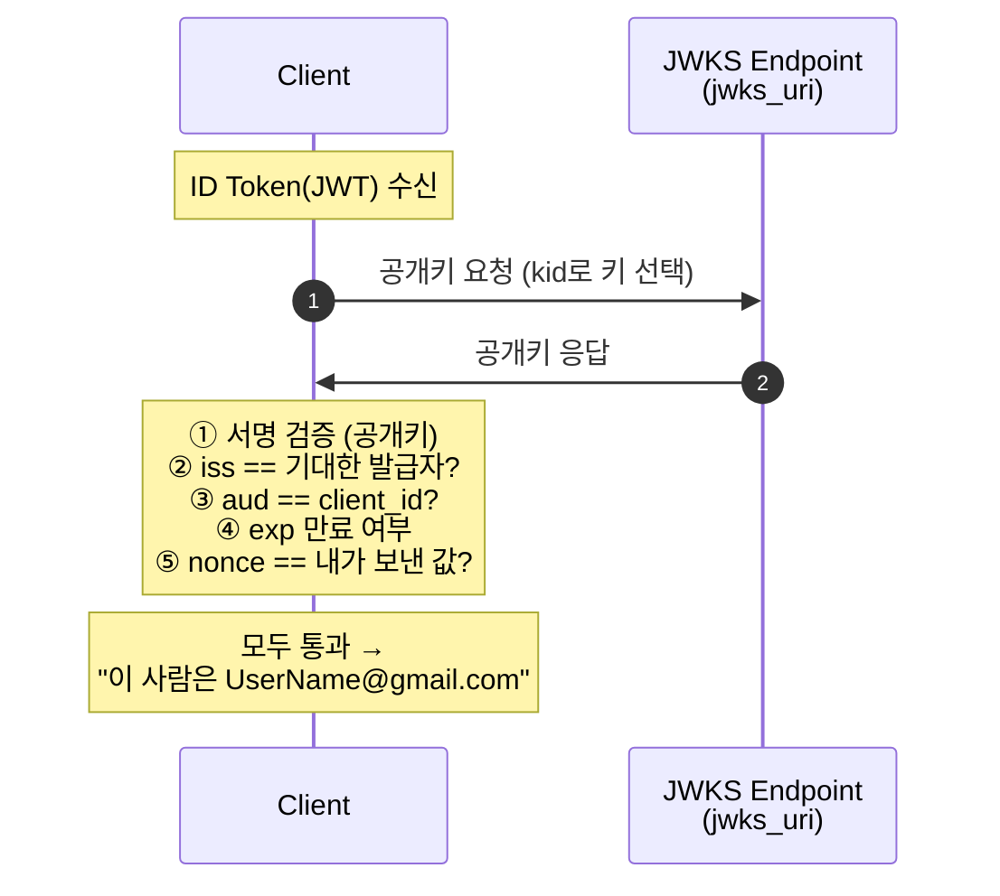

# OAuth2와 OIDC

## 들어가며

전 직장에서 상사분에게 요즘 로그인을 어떻게 만드는지에 대해 물어본 경험이 있었다. 그때, 상사분께서 최근에는 OAuth2와 OIDC를 이용해서 로그인 시스템을 만든다고 하셨는데, 그래서 간단한 개념 정도만 짚고 넘어간 경험이 있었다. 퇴사 이후에 회원쪽 채용공고를 찾아보면 거의 대부분이 OAuth2와 OIDC가 채용공고에 기본으로 들어가 있길래 다시 한번 개념에 대해 정리를 해봐야 될 필요성을 느꼈기 때문에 이에 대해 다시 한번 정리해보고자 작성하게 되었다.

## 개념 정의

> OAuth2는 "인가(Authorization)" 프로토콜로써, 다른 앱에 데이터를 접근하기 위해 권한을 위임받는 방법이다. OIDC는 OAuth2 위의 인증 레이어로써, 사용자가 누구인지를 표준화된 방식(ID Token, JWT Token)으로써 알려주는 방식이다.

## OAuth2

> 서비스가 비밀번호를 얻지 않아도, 타 시스템으로부터 토큰을 대신 발급받아서, 그 서비스는 출입증만 받는 것을 말한다.

예를 들면, 휴대폰으로 사진을 찍는다면 그걸 자동으로 구글 드라이브에 업로드한다고 해보자. 하지만 이때 구글 비밀번호를 공유해버리는 건 최악의 방식이다. 이 경우 발생하는 문제는 4가지가 있다.

- 과한 권한 : 비밀번호를 넘기는 순간, 나는 구글 이미지만 접근하게 하고 싶었지만, Gmail, 결제 정보, 드라이브 등등 모든 권한에 접근할 수 있게 된다. 드라이브뿐만 아니라 모든 계정 정보에 접근할 수 있게 열어준 셈이다.
- 철회 불가 : 중간에 서비스를 중단하고 싶어도, 비밀번호를 바꾸지 않는 한, 그 서비스의 접근을 막을 방법이 없다.
- 유출 위험 : 서비스가 해킹당하면 내 비밀번호가 그대로 해킹범한테 넘어가게 된다.
- 감사·추적 불가 : 비밀번호로 직접 로그인한 것과 위임받은 서비스가 접근한 것을 구분할 수 없다. 누가 어떤 권한으로 무엇에 접근했는지 추적이 불가능하다.

그래서 이걸 막고, 토큰만 발급받아서 접근 권한을 열어주고, 마음이 바뀐다면 얼마든지 접근을 막을 수 있게 하는 것을 말한다.

### Access Token, Refresh Token, Scope

OAuth2에서 가장 중요한 게 토큰인데, 이 종류는 3가지가 있다.

#### Access Token

- 자원에 접근할 때 쓰는 토큰
- API를 호출할 때 `Authorization: Bearer <token>` 헤더에 담아 보낸다.
- 유출되더라도 피해를 줄이기 위해 수명이 짧다.
- 포맷은 랜덤 문자열인 opaque token일 수도 있고, 정보가 담겨 있는 JWT일 수도 있다.
- Client는 Access Token의 내용을 들여다보면 안 된다.

#### Refresh Token

- Access Token이 만료됐을 때, 재로그인 없이 Access Token을 받아오기 위한 토큰
- 수명이 길다.
- 유출되면 위험하기 때문에 안전한 곳에 보관한다.

#### Scope

- 토큰으로 접근할 수 있는 자원을 정의한다.
- 사진만 접근하는 토큰인 경우, 사진 말고 다른 정보에 접근할 수 없도록 막는다.

### Authorization Code Grant

이 프로세스에서 핵심 요소는 아래와 같다.

> [!IMPORTANT]
> 브라우저를 통해 오가는 정보와 서버끼리 오가는 정보를 분리한다

### Code와 토큰을 분리하는 이유

인증 코드를 받고 토큰을 교환하는 과정을 거치지 않고, 그냥 처음부터 토큰을 주지 않는 이유는 아래와 같다.

- 리다이렉트는 브라우저 주소창에 그대로 노출되기 때문에, 이건 악성 앱이 접근할 수 있는 부분이다.
- 그래서 이 부분에서 오가는 값은, 중간에 탈취당하더라도 문제없는 인증 코드이다.
- 정말로 데이터에 접근할 수 있는 Access Token은 client_secret를 함께 제출해서 Server-To-Server로 받아온다.

> [!NOTE] 
> 탈취당할 수 있는 부분은 교환권만 받고, 서버끼리의 통신으로 토큰을 받는 구조이다. 중간에 탈취당하더라도 client_secret를 알지 못하는 한 토큰을 받아올 수가 없다.

## PKCE

위의 방식에도 문제가 있는데,

위 흐름은 `client_secret`을 안전하게 보관할 수 있는 **서버 사이드 애플리케이션**에서는 잘 동작한다. 그런데 **모바일 앱이나 SPA(브라우저 단독 앱)** 는 문제다. 이런 앱들은 코드가 사용자 기기에 그대로 노출되므로, `client_secret`을 숨길 곳이 없다.

그래서 등장한 게 **PKCE(Proof Key for Code Exchange, "픽시"라고 읽는다)** 이다. `client_secret` 없이도, **매 요청마다 일회용 비밀을 동적으로 만들어** 인증 코드 가로채기 공격을 막는다.

동작은 간단하다.

1. Client가 매 요청마다 랜덤 문자열 **`code_verifier`** 를 생성한다.
2. 이걸 해시(SHA-256)한 값 **`code_challenge`** 를 만들어, 인증 요청(2단계)에 함께 보낸다.
3. 나중에 토큰을 교환할 때(8단계), **원본 `code_verifier`** 를 같이 제출한다.
4. Authorization Server는 `SHA-256(code_verifier) == code_challenge`인지 검증한다.

공격자가 인증 코드를 가로채더라도, **원본 `code_verifier`를 모르기 때문에** 토큰으로 바꿀 수 없다. `code_challenge`(해시)만으로는 원본을 역산할 수 없기 때문이다.

## OIDC가 필요한 이유

이 방식에서 빠진 가장 중요한 점은 "이 사람이 누구인지"에 대한 정보이다. 흐름을 보면 Client가 가지고 있는 건 다른 서비스에 접근이 가능하게 해주는 Access Token, 즉 인가이지, 누구인지에 대한 인증 정보는 없다.

하지만, 대부분의 사이트에서 구글/네이버 로그인 기능들은 이 사람이 `UserName@gmail.com`인 걸 확인하는 게 중요한 거지, 이 사람이 google의 어떤 기능에 접근할 수 있느냐는 굳이 중요하지 않다. 하지만 Access Token만으로는 이 정보를 알 수가 없다. 굳이 알아내고 싶다면 해당 정보가 필요할 때마다 google에 접근해서 정보를 받아와야 한다.

이것을 해결하기 위한 방법이 OIDC이다.

### OIDC란?

> OIDC는 OAuth2 위의 인증 레이어로써, 사용자가 누구인지를 표준화된 방식(ID Token, JWT Token)으로써 알려주는 방식이다.

즉, OIDC란 OAuth2의 대체가 아니라, OAuth2 위의 확장이다.

OAuth2와 동일하지만, 2가지가 다르다.

1. `scope`에 `openid`를 포함 → OAuth2가 인증도 받겠다는 뜻
2. Client는 Access Token과 함께 **ID Token**을 받는다.

### ID Token vs. Access Token

| |**ID Token**|**Access Token**|
| --- | --- | --- |
| 목적 | 인증 | 인가 |
| 형식 | 항상 **JWT** | JWT 또는 opaque |
| 내용 | 인증용, 유저 프로필 정보 등 | 리소스 접근용, 유저 정보x |
| Client의 내부 조회 여부 | Client가 검증·해석해야 함 | Client는 보지 않음 |

#### ID Token은 왜 항상 JWT일까?

핵심은 **"누가 읽느냐"** 이다. Access Token은 리소스 서버용이라 Client가 안 봐도 되니 opaque 문자열이어도 무방하다. 하지만 ID Token은 **Client가 직접 검증·해석해야** 하므로, 자기 완결적(self-contained)이고 서명 검증이 가능한 JWT여야 한다. 앞서 "Client는 Access Token을 들여다보면 안 된다"고 했던 것과 정확히 대비되는 지점이다.

JWT 토큰에는 `claim`이라고 하는 사용자 정보가 들어 있는 부분이 있다.

- `aud`: Client ID
- `sub`: **발급자(`iss`) 내에서 유일한 사용자 식별자.** 즉 `iss` + `sub` 조합이 글로벌하게 유니크한 한 명의 사용자를 가리킨다.
- `iss`: 토큰 발급자(IdP, Identity Provider)
- `iat`, `exp`: 토큰 발급 및 만료 시간
- `nonce`: 인증 요청 시 Client가 보낸 일회성 랜덤값. ID Token 리플레이 공격을 막는다.

### ID Token "검증"이란 무엇인가?

다이어그램에서 "ID Token 검증"이라고만 적었지만, 실제로는 아래 항목들을 확인하는 과정이다. 이게 OIDC의 핵심이다.

- **서명 검증** : OP의 공개키(JWKS 엔드포인트, `jwks_uri`에서 조회)로 토큰 서명을 확인한다. "이 토큰이 진짜 구글이 발급한 게 맞는가"를 검증하는 단계다.
- **`iss` 확인** : 내가 기대한 발급자(예: `https://accounts.google.com`)가 맞는지 확인한다.
- **`aud` 확인** : 토큰의 `aud`가 내 `client_id`와 일치하는지 확인한다. (다른 Client용 토큰을 재사용하는 것을 막는다.)
- **`exp` 확인** : 만료되지 않았는지 확인한다.
- **`nonce` 확인** : 인증 요청 때 보낸 `nonce`가 ID Token에 그대로 담겨 돌아왔는지 확인한다. → ID Token 리플레이 방어.

> PKCE가 **인증 코드 가로채기**를 막는다면, `nonce`는 **ID Token 리플레이**를 막는다. 둘 다 일회성 값으로 재사용 공격을 차단한다는 점에서 짝을 이루는 장치다.

### ID Token vs. UserInfo 엔드포인트

앞에서 "정보가 필요할 때마다 google에 접근해서 받아와야 한다"고 했는데, 사실 이 동작도 OIDC가 **UserInfo 엔드포인트**라는 이름으로 표준 정의하고 있다. 즉 OIDC는 사용자 정보를 받는 두 가지 경로를 제공한다.

- **ID Token** : 로그인 시점에 필요한 사용자 정보를 한 번에 받아 Client가 자체 검증한다.
- **UserInfo 엔드포인트** : 이후 추가 정보가 필요할 때, Access Token으로 OP에 조회한다.

ID Token에 모든 정보를 다 담으면 토큰이 비대해지므로, 최소한의 식별 정보는 ID Token으로 받고 나머지는 필요할 때 UserInfo로 가져오는 식으로 역할을 나눈다.

## 참고 문헌

- [OpenID Connect와 OAuth2.0](https://velog.io/@wlsh44/OpenID-Connect%EC%99%80-OAuth2.0)
- [OAuth 2.0의 인가 스펙과 OIDC(OpenID Connect)의 인증 스펙에 대해서 알아봅시다](https://sabarada.tistory.com/264)