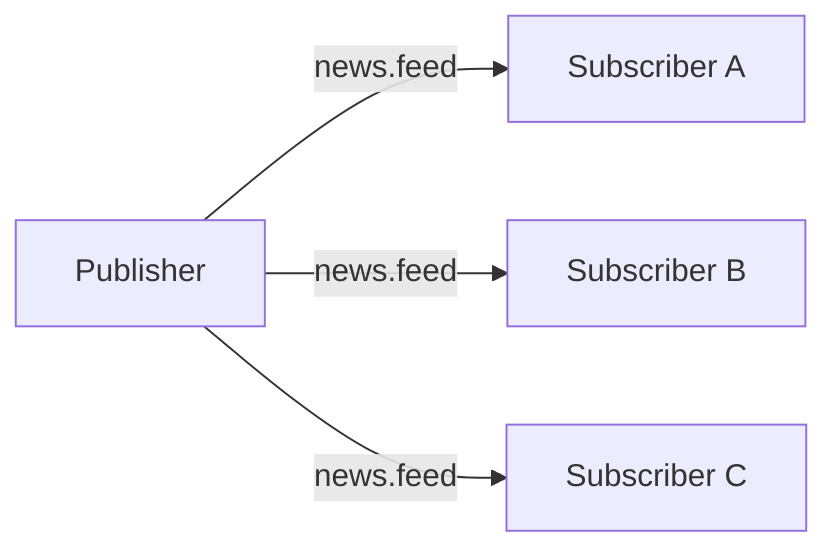
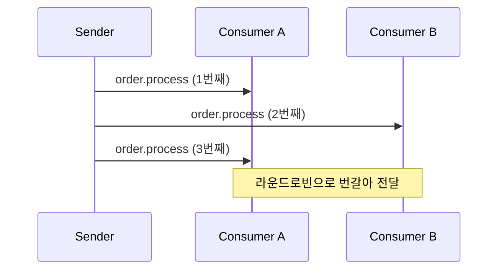
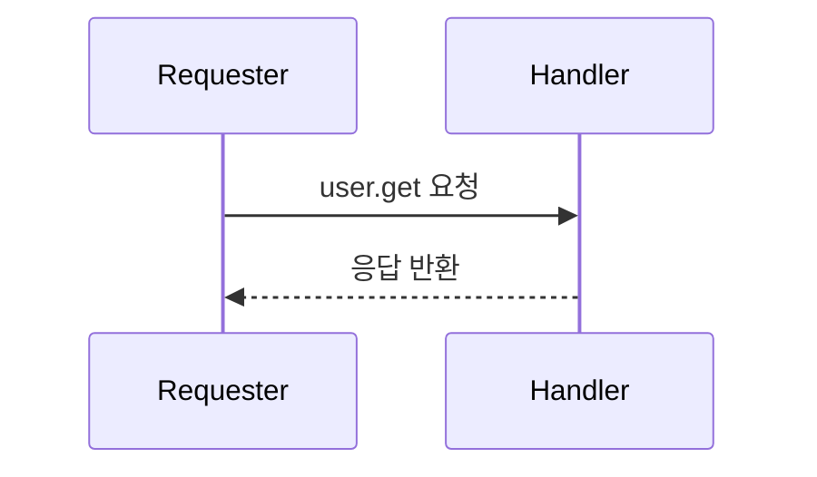
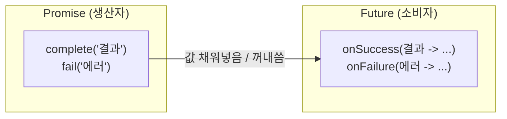
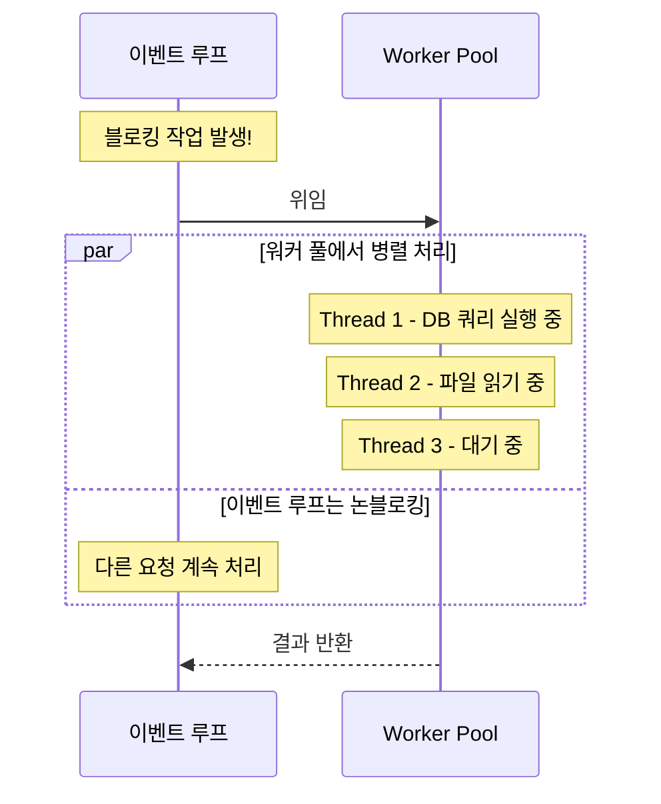
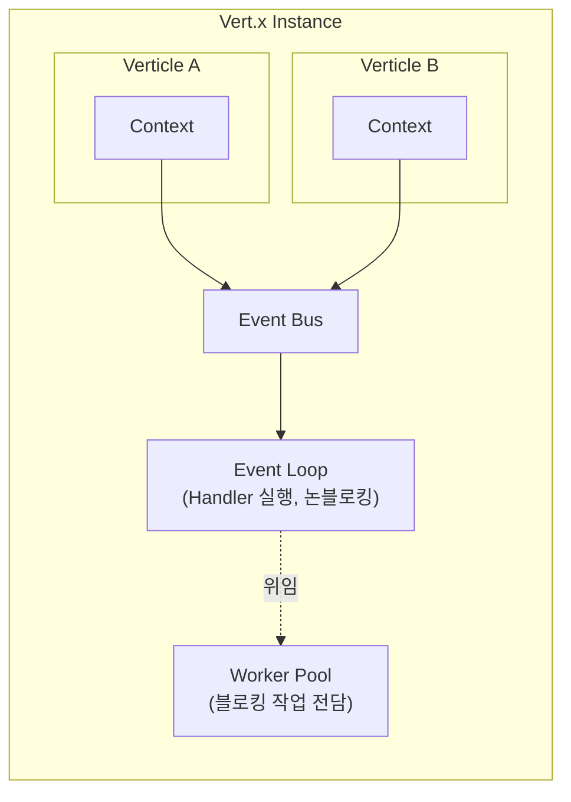

# Vert.x

## Vert.x란?

>  JVM(Java Virtual Machine) 위에서 동작하는 **비동기 이벤트 기반 애플리케이션 툴킷**

## Vert.x의 철학

Vert.x는 Node.js로 부터 영향을 받은 프로젝트로써, Node.js처럼 Event-based 프로그래밍 모델을 제공하는 서버 프레임워크다. 즉, 비동기 형태의 API를 제공한다.

다만, 영향을 받은 수준이지 Java로 작성된 것처럼 전혀 다른 고유한 철학을 가지고 있다.

### 핵심 특징

#### **폴리글랏 (Polyglot)**

1. Vert.x 자체는 Java로 작성되었지만, Vert.x는 Java로만 사용할 필요는 없다. JVM 언어 뿐만 아니라, Groovy, Javascript 등의 언어로도 vert.x를 사용할 수 있다.
2. Verticle 단위로 서로 다른 언어로 작성된 모듈을 섞어서 하나의 애플리케이션을 구성할 수 있다.
   - 단, 같은 코드베이스 내에서 여러 언어를 마구 섞는 것은 권장하지 않는다.

#### **Event Bus**

1. 애플리케이션의 각 부분이 느슨하게 결합(loosely coupled)되어 메시지를 주고받을 수 있다.
2. Vert.x로 만든 여러 서비스 프로그램이 원활하게 통신하게 하는 것까지 목표라서, 단일 서버 뿐만 아니라 클러스터 단위로 작동한다.

#### **Same-thread Verticle Execution Model**

1. 같은 Verticle 내의 코드는 항상 단일 스레드 위에서 실행되기 때문에 싱글 스레드 애플리케이션을 작성하듯 코드를 작성해도 괜찮다.
2. synchronized나 volatile 같은 동기화를 위한 locking 처리를 신경 쓰지 않아도 된다.
3. 단, 이벤트 루프를 블로킹하면 안된다.
    - 블로킹이 필요한 작업은 `executeBlocking`이나 Worker Verticle로 위임해야 한다.

#### **Module System & Public Module Repository**

1. Vert.x는 자체적으로 모듈 시스템이다.
2. 이렇게 만들어진 모듈은 공개 저장소에서 공유하고, 공유받을 수 있다.

## Vert.x의 용어

### Verticle

- Vert.x에서 배포의 기본 단위이자 실행 단위이다. 각 Verticle은 독립적으로 작동한다.
- 각 Verticle은 고유의 클래스 로더를 가지며, 이로 인해 Verticle 간의 static, global 변수 등을 통한 직접적인 상호작용을 막을 수 있다.
- Verticle들을 이용해서 인스턴스 간에 클러스터링되도록 설정할 수 있다.

### Context

- 각 Verticle 인스턴스에 묶이는 실행 컨텍스트이다.
- 이벤트 루프 스레드, 배포 옵션, Verticle별 데이터 저장소 등을 포함한다.
- ThreadLocal 대안으로 `Context.putLocal()` / `Context.getLocal()`을 사용할 수 있다.

### Event Loop

- 이벤트를 계속 감시하는 무한 루프를 의미한다.
- Vert.x 인스턴스는 내부적으로 스레드 풀을 관리하며, **기본값은 `2 × CPU 코어 수`** 만큼의 이벤트 루프 스레드를 생성한다.
  - 코어 수와 1:1이 아닌 이유는, OS가 항상 스레드를 코어에 골고루 분산시키지 않기 때문에 2배수가 실측에서 더 나은 결과를 보였기 때문이다.
- 각각의 스레드에서는 Event Loop를 실행하고, 무한 루프를 돌다 Call Stack이 비면 Queue에 쌓여있는 이벤트가 있으면 실행한다.

### Message Passing

- Event Bus를 이용해서 Verticle들이 서로 메시지를 주고받는다.

**Publish / Subscribe (1 : N)**



**Point-to-Point Send (1 : 1, 라운드로빈)**



**Request / Reply (요청 - 응답)**




### Handler

- Handler의 본질은 "무언가가 발생했을 때, 그것을 어떻게 처리할지 정의한 것"입니다.
- Vert.x는 서로 간에 이벤트 버스를 통해 통신하기 때문에, 서로 간의 요청을 핸들러로 처리하게 된다.

```java
// HTTP 요청 핸들러
server.requestHandler(req -> {        // ← 이게 Handler
    req.response().end("Hello!");
});

// 타이머 핸들러
vertx.setTimer(1000, id -> {          // ← 이게 Handler
    System.out.println("1초 후 실행");
});

// Event Bus 핸들러
eb.consumer("address", msg -> {       // ← 이게 Handler
    System.out.println(msg.body());
});
```

### Shared Data

- 이벤트 버스를 이용한 Message Passing은 매우 유용한 vert.x의 통신 방법이지만, 항상 유용한 것은 아니다. 종종 서로 간의 critical section을 이용한 처리가 효율이 좋아지는 경우가 있다.
- 그렇기 때문에 전역에서 접근할 수 있는 방법을 제공한다. 그것이 Shared Map이다.
  - Verticle 사이에서는 오직 불변(immutable) 데이터 또는 `Shareable` 인터페이스를 구현한 데이터만 공유된다.

### Future / Promise

Vert.x는 비동기로 작동하기 때문에, 언젠가 값을 받을 것을 약속하고 기다려야 한다. 그것을 보장하는 것이 `Future / Promise` 이다.

1. **Promise**

지금은 값이 없지만, 앞으로 채워질 것을 약속하는 객체



2. **Future**

지금은 값이 없지만, 이 시점에서 값을 꺼내 쓰겠다는 객체. 즉, 비동기로 요청을 한 다음에 이걸로 값을 꺼내 쓰고, 값이 없다면 기다리겠다는 뜻이다.

```
Promise = 상자에 값을 넣는 쪽  (생산자)
Future  = 상자에서 값을 읽는 쪽 (소비자)

Promise ──────────────────► Future
  (값 채워넣음)               (값 꺼내씀)
  complete("결과")            onSuccess(결과 -> ...)
  fail("에러")                onFailure(에러 -> ...)
```

### Future 체이닝

각 단계가 비동기이고, 이전 단계의 결과가 있어야 다음 단계 실행이 가능하다. 얻은 Future를 통해 다음 Future을 실행하겠다는 뜻이다.

```java
getUserById(userId)              // Future<User>
    .compose(user -> getOrders(user))     // Future<Orders>
    .compose(orders -> sendEmail(orders)) // Future<Void>
    .onSuccess(v -> System.out.println("완료!"))
    .onFailure(err -> System.out.println("실패: " + err)); // 체인 어디서 실패하든 한 곳에서 처리
```

### Worker Pool

블로킹 작업을 처리하는 전용 스레드 풀. 이벤트 루프를 블로킹하면 모든 이벤트 루프가 지연되므로, 오래 걸리는 작업을 Worker Pool로 위임한다. 기본 Worker Pool 크기는 20개 스레드이다.



위임하는 방법은 두 가지가 있다:
1. executeBlocking - 블로킹 코드를 그때그때 Worker Pool에 던지기

```java
vertx.executeBlocking(promise -> {
    String result = blockingDbCall();  // 블로킹 작업
    promise.complete(result);
}).onSuccess(result -> { /* 결과 처리 */ });
```

2. Worker Verticle - Verticle 자체를 Worker Pool에서 실행

```java
DeploymentOptions options = new DeploymentOptions().setWorker(true);
vertx.deployVerticle(new BlockingVerticle(), options);
```

### 전체 구조



## 주요 컴포넌트

| 컴포넌트           | 설명                                           |
| ------------------ | ---------------------------------------------- |
| Vert.x Core        | 기본 비동기 API, 이벤트 버스, 파일 시스템      |
| Vert.x Web         | HTTP 서버/클라이언트, 라우팅, REST API         |
| Vert.x Reactive    | RxJava, Mutiny 등 리액티브 스트림 지원         |
| Vert.x SQL Client  | PostgreSQL, MySQL 등 완전 비동기 DB 클라이언트 |
| Vert.x Data Access | MongoDB, Redis 등 비동기 DB 클라이언트         |
| Vert.x Cluster     | Hazelcast, Infinispan 기반 클러스터링          |
| Vert.x gRPC        | gRPC 서버/클라이언트 지원                      |

## Vert.x 간단한 예제

```java
package com.example;

import io.vertx.core.AbstractVerticle;
import io.vertx.core.Promise;
import io.vertx.ext.web.Router;

public class MainVerticle extends AbstractVerticle {

    @Override
    public void start(Promise<Void> startPromise) {
        // 라우터 생성
        Router router = Router.router(vertx);

        // GET / → "Hello, World!" 응답
        router.get("/").handler(ctx ->
            ctx.response()
               .putHeader("Content-Type", "text/plain; charset=UTF-8")
               .end("Hello, World!")
        );

        // GET /hello/:name → 이름을 받아 인사
        router.get("/hello/:name").handler(ctx -> {
            String name = ctx.pathParam("name");
            ctx.response()
               .putHeader("Content-Type", "text/plain; charset=UTF-8")
               .end("Hello, " + name + "!");
        });

        // HTTP 서버 시작 (포트 8080)
        vertx.createHttpServer()
             .requestHandler(router)
             .listen(8080)
             .onSuccess(server -> {
                 System.out.println("====================================");
                 System.out.println("  Vert.x 서버 시작!");
                 System.out.println("  http://localhost:" + server.actualPort());
                 System.out.println("====================================");
                 startPromise.complete();
             })
             .onFailure(startPromise::fail);
    }
}
```

## 비교: Spring WebFlux vs Vert.x

같은 JVM 기반 비동기 프레임워크지만 결이 좀 다르다.

| 구분            | Spring WebFlux                     | Vert.x                                |
| --------------- | ---------------------------------- | ------------------------------------- |
| 종류            | Framework                          | Toolkit                               |
| 기반            | Reactor (Reactive Streams 명세)    | 자체 Future/Promise + Reactor 패턴    |
| 동시성 모델     | Reactor의 Scheduler 기반           | Multi-Reactor (Verticle + Event Loop) |
| 생태계          | Spring Security/Data 등 풍부       | Vert.x 전용 라이브러리 필요           |
| 학습 곡선       | Spring 사용자에게 친숙             | 처음 보면 다소 생소                   |
| 메모리 풋프린트 | 상대적으로 무거움                  | 가벼움                                |

## Vert.x의 단점

이렇게만 보면 장점만 있는 기능이지만, 당연하지만 단점도 많은 기능이다.

### 다운스트림 병목 문제 - Connection Pool의 한계

비동기 프레임워크는 당장 그 본인의 thread 제약만 풀었을 뿐, 그 너머에 있는 리소스의 한계는 그대로이다.

Tomcat 같은 동기식 서버는 스레드 풀 크기 자체가 제한으로 작용한다. 요청 하나가 스레드 하나를 점유한 채로 응답을 기다리기 때문에, 다운스트림이 느려지면 자연스럽게 업스트림에서 들어오는 부하를 막는다. 하지만, 비동기 프레임워크는 DB뿐 아니라 외부 API 호출, Redis, Kafka Producer 등의 다운스트림에 무방비로 부하를 던질 수 있어서 오히려 더 위험해질 수도 있다.

**해결책**

Circuit Breaker, Rate Limiting, Bulkhead 패턴으로 대비한다. Vert.x도 `vertx-circuit-breaker` 모듈을 제공한다.

### 이벤트 루프 블로킹 문제

JPA는 근본적으로 Blocking I/O이다. 그 이유는 **JPA가 의존하는 JDBC가 소켓 레벨에서 blocking I/O이기 때문**이다. JDBC의 `socket.read()`는 응답이 올 때까지 호출 스레드를 그대로 점유한다.

이게 비동기 프레임워크에서는 치명적인데, 이벤트 루프 스레드 하나가 블로킹되면 그 스레드에 묶인 모든 Verticle의 모든 핸들러가 함께 지연되어 시스템 전체가 장애가 생길 가능성이 있다.


**해결책**

- 비동기 DB 드라이버를 사용한다 (Vert.x SQL Client, R2DBC, Hibernate Reactive 등)
- 어쩔 수 없이 블로킹 코드를 써야 한다면 `executeBlocking` 또는 Worker Verticle로 위임한다

### ThreadLocal 문제

Spring Security의 `SecurityContextHolder`, MDC 로깅 등 자주 쓰이는 라이브러리들은 내부적으로 `ThreadLocal`로 자원을 관리한다.

일반적인 Verticle 내에서는 항상 같은 이벤트 루프 스레드에서 실행되기 때문에 `ThreadLocal`이 어느 정도 동작하는 것처럼 보일 수 있지만, 다음과 같은 경계를 넘으면 문제가 생긴다:

1. **`executeBlocking` / Worker Pool로 작업을 위임할 때** — 다른 스레드에서 실행됨
2. **이벤트 버스를 통해 다른 Verticle로 메시지를 보낼 때** — 수신 Verticle은 다른 이벤트 루프 스레드에서 동작
3. **Spring MVC 기반 라이브러리를 그대로 가져왔을 때** — 한 요청이 여러 비동기 경계를 넘으면서 컨텍스트가 끊김

그렇게 되면 다른 스레드에 저장해서 없는 값을 가져오려고 하거나, 매 스레드마다 새로운 값을 채우느라 GC 압박이 생기는 등의 문제가 발생한다.

**해결책**

- 굳이 공유해야 하는 정보는 `Context.putLocal()` / `Context.getLocal()` 에 저장하거나, 메시지/파라미터에 명시적으로 담아 전파한다

### Spring 생태계와의 단절

Vert.x를 도입하면 **Spring Security, Spring Data, JPA 등 검증된 Spring 생태계를 통째로 못 쓴다.** 인증/인가, ORM, DB 접근 등을 Vert.x 전용 라이브러리(Vert.x Auth, Hibernate Reactive, Vert.x SQL Client 등)로 전부를 수정해야해서 학습 비용과 유지 비용이 크다.

## Virtual Threads Vs Vert.x

| 접근            | Virtual Threads               | Vert.x                              |
| --------------- | ----------------------------- | ----------------------------------- |
| 코드 스타일     | 블로킹 코드를 그대로 작성     | 명시적 비동기 (Future/Promise/콜백) |
| 학습 비용       | 낮음                          | 높음                                |
| 메모리/풋프린트 | 가상 스레드도 메모리는 차지함 | 더 가볍고 작음                      |
| 백프레셔 제어   | 직접 제어 어려움              | 스트림 API로 정교한 제어 가능       |


## 참고 문헌

- [https://vertx.io/](https://vertx.io/)
- [https://d2.naver.com/helloworld/163784](https://d2.naver.com/helloworld/163784)