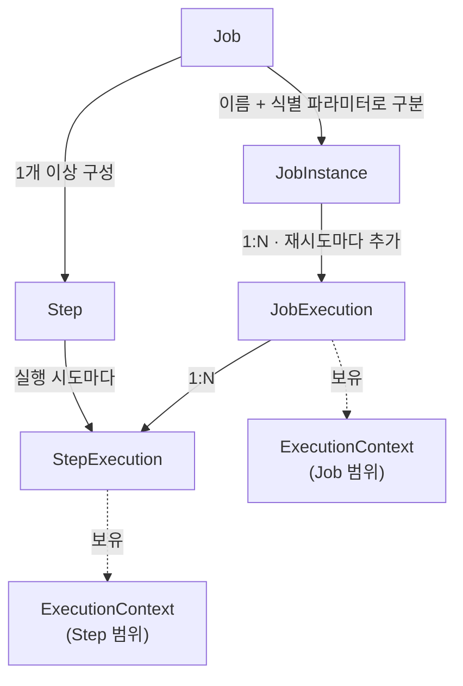
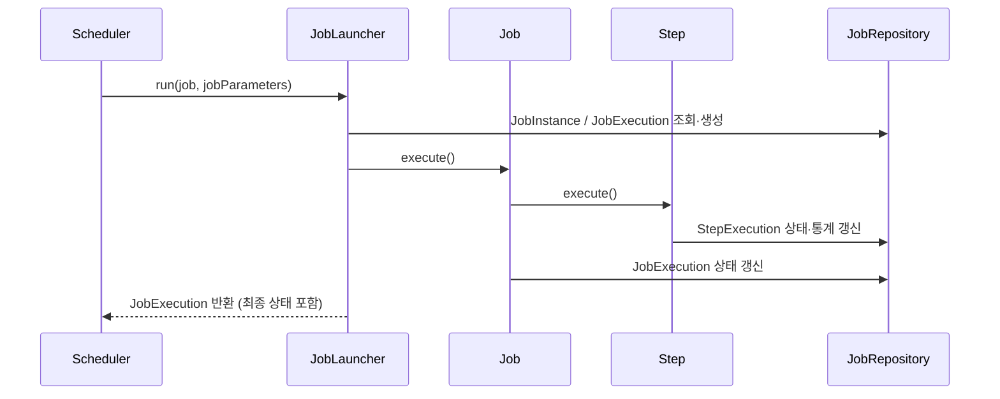
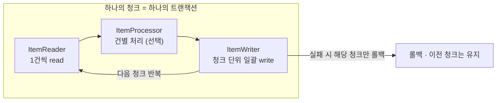

# Spring batch

## 들어가며

전 직장에는 비용 문제로 여러 역할이 하나로 통합된 서버가 있었다. 대량 처리(엑셀 등)를 담당하는 Batch, 스케줄링을 담당하는 Batch Scheduler, 그리고 Kafka Listener가 한 서버에 함께 올라가 있었고, 이를 통틀어 Batch 서버라고 부르고 있었다.

나는 그중 Kafka Listener 부분만 주로 사용하고 나머지 부분은 사용하지 않았지만, 그 사실을 명확히 인지하지 못한 채 그냥 "Batch 서버"를 다룬다고만 알고 있었다. 그러다 이직을 준비하며 본 면접에서 Batch의 개념에 대한 질문을 받았고, 제대로 답하지 못해 당황하다 탈락하는 뼈아픈 경험을 했다.

같은 실수를 반복하지 않기 위해, 그때 놓쳤던 개념을 처음부터 다시 정리하고자 이 문서를 작성하게 되었다.


## Spring Batch란?

> 자바 기반의 대용량 데이터 처리를 효율적이고 안정적으로 수행할 수 있도록 도와주는 스프링 기반의 프레임워크.
> 
> 주로 정기적으로 반복되는 작업이나 대량의 데이터를 일괄 처리하는 데 사용한다.


## Batch와 Scheduler의 차이

배치는 논리적, 물리적으로 관련된 일련의 데이터를 그룹화하여 일괄 처리하는 방법을 의미하지만, 스케줄러는 주어진 작업을 미리 정의된 시간에 실행할 수 있게 해주는 도구나 소프트웨어를 의미한다.

- 즉, 배치는 대량의 데이터를 일괄적으로 처리할 뿐, 특정 주기마다 자동으로 실행되는 스케줄링과는 별개의 개념이다.
- Batch는 보통 스케줄러와 함께 사용할 수 있도록 설계되어 있을 뿐, 스케줄러와는 별개이다.
- 스케줄러(Spring `@Scheduled`)는 "언제 실행할지"를 트리거하고, 실제 Job의 생명주기 관리는 Spring Batch의 `JobLauncher`가 담당한다.

## Spring Batch의 용어

### Job

- 전체 배치 처리 과정을 캡슐화한 엔티티. 배치 처리 과정을 하나의 단위로 만들어 놓은 객체.
- 각 Job은 고유한 이름을 가지며, 이 이름은 실행에 필요한 파라미터(`JobParameters`)와 함께 `JobInstance`를 구별하는 데 사용된다.

### JobInstance

- Job 실행의 단위. "Job 이름 + 식별용 JobParameters"의 조합으로 결정된다.
  - 예) `dailyReportJob`을 `date=2025-06-01` 파라미터로 실행하면, 그 조합에 대응하는 `JobInstance`는 딱 1개만 생성된다.
- 실패한 JobInstance는 동일한 식별 파라미터로 다시 실행하면 그대로 재사용되며, 그 아래에 새로운 `JobExecution`이 추가로 생성된다.
  - 이런 구조인 이유는 재시작과 복구를 위해서이다.
- 반대로 이미 성공적으로 완료된 JobInstance는 동일한 식별 파라미터로 다시 실행할 수 없다.
  - `JobInstanceAlreadyCompleteException`를 발생시킨다.
  - 같은 잡을 또 돌리려면 파라미터를 바꾸거나 비식별 파라미터를 활용해야 한다.
    - Batch Job에서 `run.id` increase가 종종 보이는 이유가 이것 때문이다.
- JobExecution은 반대로 재시도할 때마다 새로 생기고 재사용하지 않는다.

### Step

- Job을 구성하는 작업 단위.
- 배치 Job의 처리를 정의하고 순차적인 단계를 캡슐화한 도메인 객체. Job은 하나 이상의 Step을 가져야 한다.
- Step은 Job의 하위 단계로써, 실제 배치 처리 작업이 이루어지는 단위
- 한 개 이상의 Step으로 Job이 구성되며, 각 Step은 순차적으로 처리된다.
- 각 Step은 "Chunk 방식" or "Tasklet 하나"를 가질 수 있다.

### JobLauncher

- Job을 실행시키는 역할.
- `Job`과 `JobParameters`를 받아서 Job을 실행시킨다.
- 전반적인 Job의 생명주기를 관리하며, `JobRepository`를 통해 실행 상태를 유지한다.

### JobRepository

- 메타데이터 테이블이자, Job의 실행 정보·상태를 저장하고 관리하는 역할.
  - `BATCH_JOB_INSTANCE`, `BATCH_JOB_EXECUTION`, `BATCH_STEP_EXECUTION`, `BATCH_JOB_EXECUTION_CONTEXT` 등에 상태를 영속화한다. 
    - 어디까지 진행됐는지에 대한 정보를 이 테이블에 남기기 때문에, 재시작이 가능하다.


### ExecutionContext

- 프레임워크가 유지·관리하는 key-value 컬렉션. 
  - `JobExecution`과 `StepExecution`들이 각자 하나씩 가지며, 상태를 저장한다.
- Job 실행 도중 상태를 저장하고 공유하는 저장소이며, Job이나 Step이 실패했을 때 이를 통해 진행 지점을 복구하거나 재시작한다.
- Job 범위에서 사용하는 `ExecutionContext`을 `JobExecution`, Step 범위에서 사용하는 `ExecutionContext`을 `StepExecution`라고 부른다.

### JobExecution

- `JobInstance`를 한 번 실행한 "시도(attempt)"를 표현하는 객체.
- 같은 `JobInstance`를 재시도하더라도, 기존 `JobExecution`을 재사용하지 않고 **새로운 `JobExecution`이 생성**된다.
- 실행 상태, 시작 시간, 종료 시간, 생성 시간 등 실행 세부 정보를 가진다.

### StepExecution

- 특정 Step의 한 번의 실행 시도 정보를 담은 객체.
- 읽은 건수(read count), 쓴 건수(write count), 커밋 수, 스킵 수, 상태 등 Step 단위의 통계와 상태를 가진다.




## 실행 흐름

스케줄러는 트리거만 담당하고, 실제 생명주기는 `JobLauncher`가 관리한다.




## Tasklet 방식

> 한 Step 내에서 단일 작업을 수행하는 인터페이스.
> 
> 한 번의 실행으로 완료되는 비교적 단순한 작업에 적합하다.

### 특징

- 단순한 작업에 적합하다 : 
  - 한 번의 실행으로 완료되는 작업(파일 정리, 프로시저 호출, 테이블 truncate 등)에 적합하다.
- 직관적인 구현이 가능하다 : 
  - `Tasklet` 인터페이스를 구현하여 `execute()` 메서드에 작업 로직을 작성한다.
- 트랜잭션 처리 : 
  - 전체 작업이 하나의 트랜잭션으로 처리된다.
- 재시작 시 처리 : 
  - Chunk처럼 "어디까지 처리했는지"에 대한 중간 체크포인트가 없으므로, 실패하면 트랜잭션 전체가 롤백되고 처음부터 다시 실행된다. 
  - 단, 필요하다면 `ExecutionContext`에 진행 상태를 직접 저장해 이어받기를 구현할 수도 있다.

### 작업 흐름

- `Tasklet` 인터페이스의 `execute()` 메서드를 구현하여 사용한다. 이 메서드는 하나의 트랜잭션 범위에서 실행된다.
- `execute()` 메서드는 `RepeatStatus`를 반환하며, 이것은 Tasklet의 실행 상태를 나타낸다.
  - `RepeatStatus.FINISHED`: 해당 Tasklet의 처리가 완료되었다.
  - `RepeatStatus.CONTINUABLE`: Tasklet이 계속 실행되어야 한다.

## Chunk 방식

> 대량의 데이터를 작은 단위(chunk)로 나누어 처리하는 방식.
> 
> 데이터를 읽고(ItemReader), 처리하고(ItemProcessor), 쓰는(ItemWriter) 작업을 반복적으로 수행한다. 주로 대용량 데이터 처리에 사용된다.

### 구성 요소

#### ItemReader

- 배치 작업에서 처리할 아이템을 데이터 소스로부터 읽어오는 역할을 한다.
- 여러 형식의 데이터 소스(예: 데이터베이스, 파일, 메시지 큐 등)으로 부터 데이터를 읽어오는 다양한 ItemReader 구현체가 제공된다.

#### ItemProcessor

- 필수적인 구현 요소가 아니다.
- `ItemReader`가 읽어온 아이템을 데이터 가공·검증·필터링·변환하는 역할을 한다.
- 그래서 ItemProcessor 부분은 필요한 경우에만 구현하며, 데이터 검증, 필터링, 변환 등의 작업을 수행할 수 있다.
- `null`을 반환하면 해당 아이템은 `ItemWriter`로 넘어가지 않고 제외된다(필터링).

#### ItemWriter

- ItemWriter는 ItemProcessor에서 처리된 데이터를 최종적으로 기록하는 역할을 한다.
- ItemWriter 역시 다양한 형태의 구현체를 통해 데이터베이스에 기록하거나, 파일을 생성하거나 메시지를 발행하는 등 다양한 방식으로 데이터를 쓸 수 있다.


### 예제

1. Lambda(인라인 메소드)로 구현한다
	- 한 두줄로 끝나는 간단한 처리과정일때 적합
2. 메서드로 구현한다.
	- 다른 Job에서 재사용되지 않거나, 중간 정도의 복잡도일때 적합
3. 독립된 Bean(클래스)로 분리한다.
	- 컴포넌트로 작성한다.
	- 로직이 복잡하거나 재사용이 간편하다


#### 메서드(람다) Step

Step 빌더 안에서 함수형 인터페이스를 람다로 바로 작성한다.

```kotlin
@Bean
fun sampleStep(
    jobRepository: JobRepository,
    transactionManager: PlatformTransactionManager,
): Step =
    StepBuilder("sampleStep", jobRepository)
        .chunk<Order, SettledOrder>(1000, transactionManager)
        .reader(orderReader())
        .processor { order ->                 // 람다로 인라인 선언
            if (order.isInvalid()) null        // null 반환 -> 필터링
            else order.toSettled()
        }
        .writer { settledOrders ->
            settledOrderRepository.saveAll(settledOrders)
        }
        .build()
```

- 장점: 코드가 짧다면 흐름을 파악하기 쉽고, 간단한 로직에 적합하다.
- 단점: Step과 로직이 뭉쳐있어 단위 테스트가 어렵고, 재사용이나 의존성 주입이 어렵다.

#### 클래스 Step

```kotlin
@Component
class OrderItemProcessor : ItemProcessor<Order, SettledOrder> {
    override fun process(item: Order): SettledOrder? {
        if (item.isInvalid()) return null      // null 반환 -> 필터링
        return item.toSettled()
    }
}
```

```kotlin
@Bean
fun sampleStep(
    jobRepository: JobRepository,
    transactionManager: PlatformTransactionManager,
    orderItemProcessor: OrderItemProcessor,    // 빈으로 주입
): Step =
    StepBuilder("sampleStep", jobRepository)
        .chunk<Order, SettledOrder>(1000, transactionManager)
        .reader(orderReader())
        .processor(orderItemProcessor)
        .writer(orderItemWriter())
        .build()
```

- 단위 테스트가 쉽다: 
  - 전체 Job을 테스트 할 필요가 없이, 해단 Step의 또 그 안의 `process()`만 테스트 할 수 있다.
- 의존성 주입이 간편하다: 
  - Repository나 외부 API 클라이언트를 사용해야 할 때, 해당 클래스에만 의존성울 추가하면 되기 때문에 편하다.
- 재사용이 쉽다 :
  - 아예 독립된 컴포넌트를 갖다 쓰는 것이기 때문에 각자 다른 JOB에서 재사용하기 편하다
- 가독성: 
  - 검증,변환 로직이 길어질 때 분리함으로써 클래스에 기능을 묶어둠으로써 가독성이 편하다

요약하면, 람다 방식이든 클래스 방식이든 동일한 Chunk 처리이며, 클래스 방식은 테스트·재사용·DI를 위한 선택이다. 로직이 단순하면 람다, 복잡하거나 테스트·주입이 필요하면 클래스로 분리하는 것이 일반적이다.

#### `@StepScope`와 late binding

컴포넌트를 클래스(빈)로 만들면, 실행 시점의 `JobParameters`나 `ExecutionContext` 값을 주입받고 싶을 때가 많다. 이때 `@StepScope`를 붙이면 빈 생성이 **Step 실행 시점까지 지연(lazy)**되어, 아래처럼 late binding이 가능해진다.

```kotlin
@Bean
@StepScope
fun orderReader(
    @Value("#{jobParameters['date']}") date: String,   // 실행 시점에 주입
): ItemReader<Order> {
    return JpaPagingItemReaderBuilder<Order>()
        // ... date 기반 쿼리 구성
        .build()
}
```

- 일반 싱글톤 빈은 애플리케이션 기동 시점에 생성되므로 `jobParameters`를 알 수 없다.
- `@StepScope`(또는 `@JobScope`)를 사용하면 해당 Step(Job)이 실행될 때 비로소 빈이 생성되어, 실행 시점의 파라미터/컨텍스트를 받을 수 있다.
- 클래스로 컴포넌트를 선언하는 패턴과 거의 세트로 등장하는 개념이다.


### 동작 방식

- 데이터를 1건씩 read → 건별 process → Chunk Size만큼 모이면 한 번에 write 한다.
- Chunk 단위로 트랜잭션이 적용되어, 실패 시 해당 Chunk만 롤백되고 이전에 커밋된 데이터는 유지된다. 재시작 시 마지막으로 성공한 지점 이후부터 이어갈 수 있다.



### Skip과 Retry

Chunk 방식의 장점은 아이템 단위의 내결함성을 선언적으로 설정할 수 있다는 점이다.

- **Skip**: 
  - 특정 예외가 발생한 아이템을 건너뛰고 계속 진행한다. 
  - 예) 100만 건 중 일부 포맷 오류 데이터를 무시하고 나머지를 처리.
- **Retry**: 
  - 일시적인 오류에 대해 정해진 횟수만큼 재시도한다.
  - 예) 순간적인 네트워크/DB 타임아웃 등등

> [!NOTE]
> 두 정책 모두 발생 예외 타입과 한도(limit)를 지정할 수 있고, `SkipListener` 등으로 스킵된 항목을 별도 기록할 수도 있다.


## 참고 문헌

- [https://docs.spring.io/spring-batch/reference/](https://docs.spring.io/spring-batch/reference/)
- [https://djlife.tistory.com/31](https://djlife.tistory.com/31)
- [https://khj93.tistory.com/entry/Spring-Batch란-이해하고-사용하기](https://khj93.tistory.com/entry/Spring-Batch란-이해하고-사용하기)
- https://dkswnkk.tistory.com/707
- [https://velog.io/@wnguswn7/Tasklet-vs-Chunk-비교와-처리-테스트](https://velog.io/@wnguswn7/Tasklet-vs-Chunk-비교와-처리-테스트)
- [https://jojoldu.tistory.com/331](https://jojoldu.tistory.com/331)
