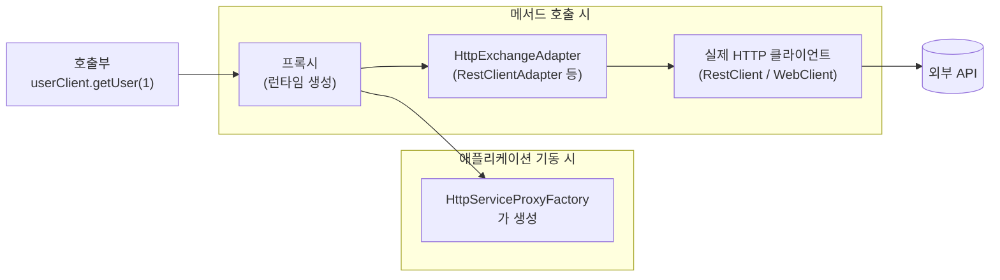
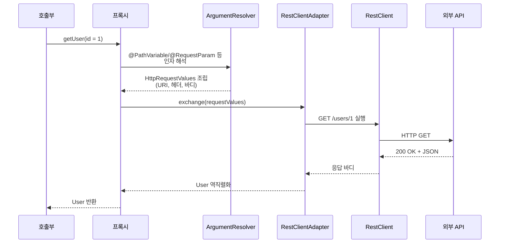

## 들어가며
전직장에서 restClient 대신 단순한 어노테이션만 사용해서 HTTP 요청하고 있었다.
복잡한 요청방식 대신 프록시 하나만 추가하고 그 이후엔 엔드포인트만 생성해서 요청하는 걸 보고 좋다고 생각해서 공부는 해놨지만, 정리를 안 하면 잊어버리고 까먹는 사람이기 때문에 다시 한번 정리해보고 싶어서 정리하게 되었다.

## Spring HTTP Interface란?

> Spring HTTP Interfaces는 외부 API 호출을 자바 인터페이스로 추상화하고, Spring이 런타임에 프록시 방식으로 이를 실제 HTTP 호출로 변환해주는 HTTP 클라이언트이다.

즉, 외부 API 호출하는 것을 이제 더이상 `RestTemplate`, `WebClient`을 직접 작성하지 않고, 자바 인터페이스 + 어노테이션 선언만으로 HTTP 클라이언트를 생성할 수 있다.
구현체는 Spring이 런타임에 프록시로 생성한다.

## 등장 배경
### 문제점

예를 들면, User 정보를 API로 직접 요청하는 코드를 생성한다면,

```kotlin
val user = restClient.get()
    .uri("/users/{id}", id)
    .retrieve()
    .body(User::class.java)
```

이런 코드가 생성되는데, 만약 유저 정보 뿐만 아니라, 유저 권한 정보, 유저 상세 정보, 유저 접근 기록 로그 등등 수많은 Request를 작성한다고 했을 때, 
url 생성하는 부부ㄴ, body 변화하는 부분, request 다음 에러 처리하는 부분 등등
즉, 유지보수 난이도가 오르고, 사이드 이펙트 관리가 어려워지고, 순환 참조로 빌드 자체가 어려워질수 까지 있다,

하지만, Spring HTTP Interface를 사용한다면 이제 인터페이스이기 때문에 한곳에 호출부분만 남기고 전부 지워 버릴 수 있게 된다.
`userClient.getUser(id)`만 남는다.

## 구성 요소
### HTTP interface
`@HttpExchange` 메서드를 가진 인터페이스. 인터페이스라 내부 구현은 작성하지 않는다.
### HttpExchangeAdapter
인터페이스를 바탕으로 프록시 개ㄱ체를 생성하는 팩토리 객체
### HttpExchangeAdapter
실제 HTTP를 실행하는 어탭터. `RestClientAdapter` / `WebClientAdapter` / `RestTemplateAdapter` 중 하나로, 내부의 진짜 HTTP 클라이언트를 감싼다.


메서드 호출 한 번이 실제 HTTP 요청으로 바뀌는 과정을 시퀀스로 풀면 이렇다.



여기서 자주 발목 잡히는 지점: **인자 해석은 `ArgumentResolver`가 한다.** Spring MVC 컨트롤러의 파라미터 바인딩과 비슷하지만 **같지 않다.** 컨트롤러에서는 경로 변수를 생략해도 추론되는 경우가 있지만, HTTP Interface에서는 `@PathVariable`을 명시적으로 붙이지 않으면 다음 예외가 난다.

그렇기 때문에  HTTP Interface의 모든 파라미터는 애너테이션으로 역할을 명시해야 한다
## 구현

### dependency

```kotlin
// build.gradle.kts
dependencies {
    implementation("org.springframework.boot:spring-boot-starter-web")
}
```

Spring Boot 3.2 이상이면 RestClient은 spring-web에 포함되어 있으므로 starter만 있으면 된다.

### 인터페이스
```kotlin
import org.springframework.web.bind.annotation.PathVariable
import org.springframework.web.bind.annotation.RequestBody
import org.springframework.web.bind.annotation.RequestParam
import org.springframework.web.service.annotation.*

@HttpExchange("/users")
interface UserClient {

    @GetExchange("/{id}")
    fun getUser(@PathVariable id: Long): UserResponseDto

    @PostExchange
    fun createUser(@RequestBody request: CreateUserRequestDto): UserResponseDto
}
```

- 클래스 레벨 `@HttpExchange("/users")` + 메서드 레벨 경로가 합쳐진다. `getUser`URI는 `/users/{id}`로 설정된다.
- 반환 타입으로 자동으로 역직렬화된다.
	-  `User`, `List<User>`, `ResponseEntity<User>`, `Void`/`Unit`을 쓸 수 있고, WebClient 어댑터라면 `Mono<User>`/`Flux<User>`도 가능하다.


### 프록시 빈 등록

`RestClient`를 구성하고, 어댑터로 감싼 뒤, 팩토리로 프록시를 만들어 빈으로 등록한다.

```kotlin
import org.springframework.context.annotation.Bean
import org.springframework.context.annotation.Configuration
import org.springframework.web.client.RestClient
import org.springframework.web.client.support.RestClientAdapter
import org.springframework.web.service.invoker.HttpServiceProxyFactory

@Configuration
class HttpClientConfig {

    @Bean
    fun userClient(builder: RestClient.Builder): UserClient {
        val restClient = builder
            .baseUrl("https://api.example.com")
            .defaultHeader("Accept", "application/json")
            .build()

        val adapter = RestClientAdapter.create(restClient)
        val factory = HttpServiceProxyFactory.builderFor(adapter).build()

        return factory.createClient(UserClient::class.java)
    }
}
```

이제 사용한다.

```kotlin
@Service
class UserService(private val userClient: UserClient) {
    fun findUser(id: Long): User = userClient.getUser(id)
}
```

### 프록시 어댑터 선택 기준

| 어댑터                   | 기반 클라이언트       | 성격        | 사용 상황                                |
| --------------------- | -------------- | --------- | ------------------------------------ |
| `RestClientAdapter`   | `RestClient`   | 동기        | 기본값.                                 |
| `WebClientAdapter`    | `WebClient`    | 리액티브/논블로킹 | `Mono`/`Flux` 반환이 필요할 때              |
| `RestTemplateAdapter` | `RestTemplate` | 동기(레거시)   | 기존 `RestTemplate` 인프라를 그대로 재사용해야 할 때 |

### 에러 처리

에러 처리는 `RestClient`/`WebClient`에 설정한다.

```kotlin
val restClient = builder
    .baseUrl("https://api.example.com")
    .defaultStatusHandler(HttpStatusCode::is4xxClientError) { _, response ->
        if (response.statusCode == HttpStatus.NOT_FOUND) {
            throw UserNotFoundException()
        }
        throw ExternalApiException(response.statusCode)
    }
    .defaultStatusHandler(HttpStatusCode::is5xxServerError) { _, _ ->
        throw ExternalApiUnavailableException()
    }
    .build()
```


## 참고 문헌
- [Spring Boot 3의 선언형 HTTP 클라이언트 – HTTP Interface란?](https://dev-post.com/spring-boot-http-interface/)
- [HTTP Interface Doc](https://docs.spring.io/spring-framework/docs/6.0.0/reference/html/integration.html#rest-http-interface)\
- [HTTP Interface Client](https://docs.spring.io/spring-framework/reference/web/webflux-http-interface-client.html)